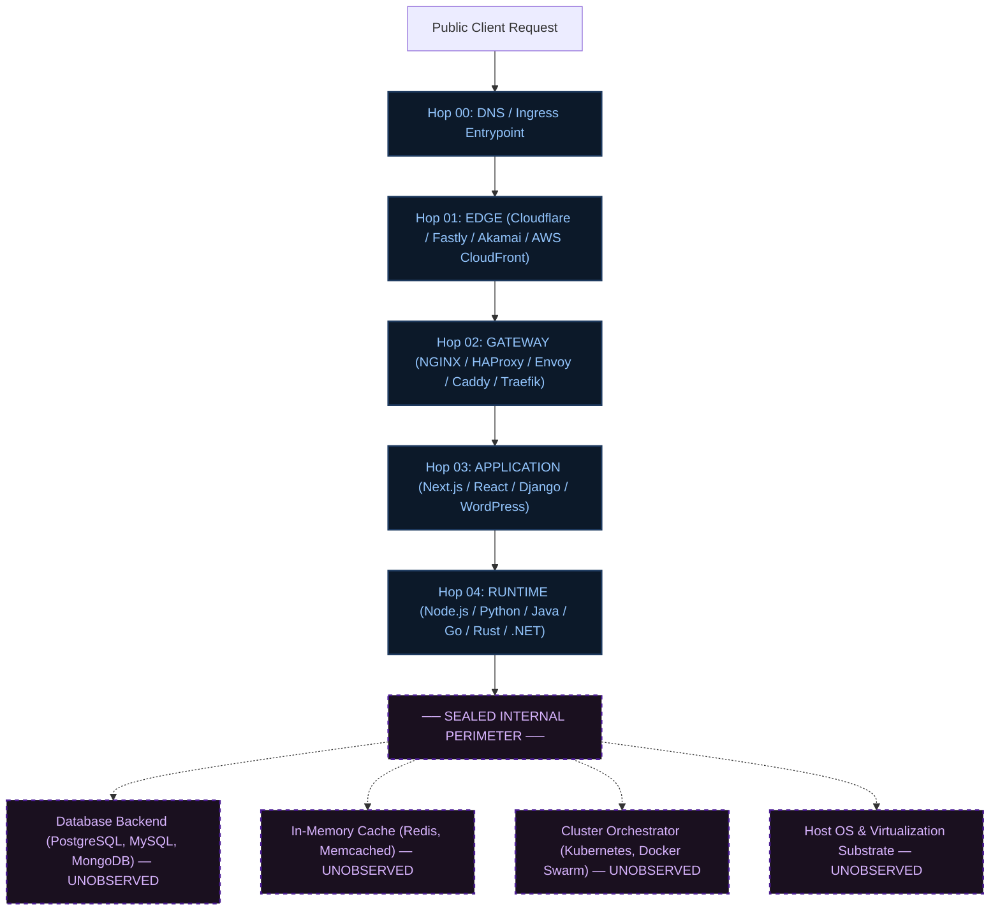

# H1 — Ingress Request Path & Topology Understanding Specification

## 1. Executive Overview

**H1 (Ingress Request Path & Topology Understanding)** elevates Nebula from isolated component discovery into an **evidence-grounded, multi-hop architectural intelligence system**.

Rather than presenting an ungrounded flat badge list of detected technologies (e.g. `Cloudflare, NGINX, Next.js, Node.js`), Nebula reconstructs the exact observable path a client request takes as it traverses the public edge, reverse-proxy ingress gateways, application frameworks, and execution runtime environments—while establishing a rigorous boundary at the sealed internal perimeter.



---

## 2. Core H1 Invariants & Architectural Rules

| Invariant | Rule | Violation Prevention |
| :--- | :--- | :--- |
| **Invariant 1: Observation ≠ Relationship** | Co-occurrence of technologies does not imply direct communication. Every topology link requires supporting evidence, relationship types (`FORWARDS_TO`, `PROXIES_TO`, `RUNS_ON`, `ENFORCED_BY`), and confidence scoring. | Zero fabricated edges; relationships cite wire evidence indicators. |
| **Invariant 2: Uncertainty Preservation** | Gaps in observation are preserved. If Edge and Node.js are observed without an intermediate Gateway, the path directly bridges Edge $\to$ Node.js. | Never manufacture a fictional NGINX or Apache gateway. |
| **Invariant 3: Independent Layer Autonomy** | Layers (`EDGE`, `GATEWAY`, `PLATFORM`, `APPLICATION`, `RUNTIME`, `INTEGRATION`) remain distinct semantic entities. | No collapsed "monolithic stack" abstractions. |
| **Invariant 4: Public vs Sealed Boundary** | Explicitly demarcates observed public ingress infrastructure from sealed internal systems. | Explicit `UNOBSERVED` / `MASKED` classification for Database, Cache, Orchestration, and Host OS. |
| **Invariant 5: Traceable Evidence Lineage** | Every hop and relationship links back to concrete wire telemetry (`headers`, `cookies`, `cname`, `tls`). | Full lineage: Synthesis $\to$ Relationship $\to$ Observation $\to$ Raw wire signal. |
| **Invariant 6: Calibrated Per-Relationship Confidence** | Each relationship carries its own confidence level (`HIGH`, `MEDIUM`, `LOW`) and rationale. | Eliminates arbitrary whole-graph guesswork. |
| **Invariant 7: Strict Anti-Overreach Invariants** | Strict guards prevent speculative inferencing: <br>• Node.js does **not** prove PostgreSQL<br>• Traefik does **not** prove Kubernetes<br>• Cloudflare does **not** prove AWS origin | Zero hallucinated badges or phantom dependencies. |

---

## 3. Data Model Contracts

### 3.1 Architecture Hop Contract (`ArchitecturePathHop`)
```typescript
export interface ArchitecturePathHop {
  hop: number;
  layer: TopologyLayer;
  technologyId: string;
  technologyName: string;
  role: string;
  relationshipType?: TechnologyRelationshipType;
  details?: string;
}
```

### 3.2 Canonical Unknowns (`ArchitectureUnknown`)
```typescript
export interface ArchitectureUnknown {
  dimension: string;
  status: 'UNOBSERVED' | 'MASKED' | 'UNKNOWN' | 'ABSENT';
  explanation: string;
  whyUnknown: string;
}
```

Canonical explicit unknown dimensions synthesized across all domain scans:
1. **Origin Cloud Provider**: `MASKED` (when Edge CDN/Proxy terminates public client connections).
2. **Private Network & VPC Topology**: `UNOBSERVED` (internal subnets and peering are unexposed).
3. **Database Backend Layer**: `UNOBSERVED` (SQL/NoSQL engines are sealed behind application services).
4. **In-Memory Caching Tier**: `UNOBSERVED` (Redis/Memcached operate within internal private perimeters).
5. **Cluster Orchestrator & Compute Substrate**: `UNOBSERVED` (Kubernetes/Docker control planes are private).
6. **Host Operating System & Compute Architecture**: `UNKNOWN` (Kernel and host OS details are unexposed).

---

## 4. Verification & Certification Matrix

### Backend Integration Suites
- [`apps/api/src/modules/understanding/h1-ingress-path-and-topology.spec.ts`](file:///home/swasthik-k-j/Desktop/Atlas/apps/api/src/modules/understanding/h1-ingress-path-and-topology.spec.ts)
  - 8/8 comprehensive vertical integration tests covering multi-hop path synthesis, evidence lineage, uncertainty preservation, anti-overreach guarantees, and DTO convergence.
- [`apps/api/src/modules/understanding/infrastructure-relationship-mapping.integration.spec.ts`](file:///home/swasthik-k-j/Desktop/Atlas/apps/api/src/modules/understanding/infrastructure-relationship-mapping.integration.spec.ts)
  - 10/10 relationship and topology rule evaluations.

### Frontend UI & Invariant Suites
- [`apps/web/src/features/workspace/workspace-h1-ingress-path-topology.spec.ts`](file:///home/swasthik-k-j/Desktop/Atlas/apps/web/src/features/workspace/workspace-h1-ingress-path-topology.spec.ts)
  - 5/5 model resolution and progressive disclosure tests.
- [`apps/web/src/features/workspace/workspace-ingress-topology-visualizer.spec.ts`](file:///home/swasthik-k-j/Desktop/Atlas/apps/web/src/features/workspace/workspace-ingress-topology-visualizer.spec.ts)
  - 12/12 interactive visualizer and boundary tests.
