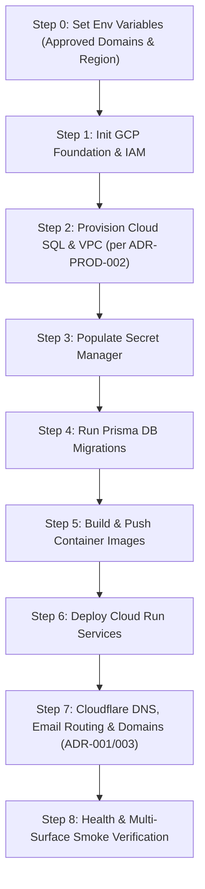

# Production Deployment Runbook

**Product**: Nebula Intelligence Platform (under Argonion)  
**Target Environment**: Google Cloud Platform (GCP)  
**Primary Region**: `asia-south1` (Mumbai, India proposed per [ADR-PROD-004](file:///home/swasthik-k-j/Desktop/Atlas/docs/production/decisions/ADR-PROD-004-DEPLOYMENT-REGION.md) / [OD-03](file:///home/swasthik-k-j/Desktop/Atlas/docs/production/OWNER-DECISIONS.md))  
**Authoritative Domains**: Approved per [ADR-PROD-001](file:///home/swasthik-k-j/Desktop/Atlas/docs/production/decisions/ADR-PROD-001-DOMAIN-ROUTING.md):
* Landing Page: `https://argonion.com`
* Canonical WWW Redirect: `https://www.argonion.com` → `https://argonion.com`
* Guest Experience (GX): `https://app.argonion.com`
* Workspace (WX): `https://nebula.argonion.com`
* Authoritative API: `https://api.argonion.com`  
**Status**: Repository preparation is complete. Production deployment remains blocked on GCP provisioning, DNS configuration, OAuth registration, and live verification.  
**Document Version**: 2.3.0  

---

## 1. Pre-Deployment Prerequisites

Before executing deployment commands, ensure the following external prerequisites and owner decisions are resolved:
1. **Google Cloud Account & Project**:
   - Google Cloud Project created (e.g. `argonion-nebula-prod`).
   - Billing account linked (or $300 GCP Free Trial credits applied).
   - Billing budget alert ($250 with 50%, 80%, 100% thresholds) created in GCP Console.
   - `gcloud` CLI installed and authenticated (`gcloud auth login`).
2. **Owner Architectural Decisions Resolved**:
   - [ADR-PROD-001: Domain Routing](file:///home/swasthik-k-j/Desktop/Atlas/docs/production/decisions/ADR-PROD-001-DOMAIN-ROUTING.md) **APPROVED BY OWNER** (`argonion.com`, `app`, `nebula`, `api`).
   - [ADR-PROD-002: Cloud SQL Sizing](file:///home/swasthik-k-j/Desktop/Atlas/docs/production/decisions/ADR-PROD-002-CLOUDSQL-SIZING.md) verified against live GCP pricing calculator.
   - [ADR-PROD-003: Email Routing](file:///home/swasthik-k-j/Desktop/Atlas/docs/production/decisions/ADR-PROD-003-EMAIL-ROUTING.md) **APPROVED BY OWNER** (Cloudflare Email Routing for inbound; Resend for outbound).
   - [ADR-PROD-004: Deployment Region](file:///home/swasthik-k-j/Desktop/Atlas/docs/production/decisions/ADR-PROD-004-DEPLOYMENT-REGION.md) reviewed (`asia-south1`).
   - [ADR-PROD-005: Edge Strategy](file:///home/swasthik-k-j/Desktop/Atlas/docs/production/decisions/ADR-PROD-005-EDGE-STRATEGY.md) **APPROVED / RECOMMENDED** (Cloudflare Edge + Cloud Run Native).
   - [ADR-PROD-006: Support & Contact Channels](file:///home/swasthik-k-j/Desktop/Atlas/docs/production/decisions/ADR-PROD-006-SUPPORT-CONTACT.md) **APPROVED / RECOMMENDED** (`security@`, `support@`, `hello@`).
   - [Owner Decision Register](file:///home/swasthik-k-j/Desktop/Atlas/docs/production/OWNER-DECISIONS.md) reviewed.
3. **Cloudflare & Registrar Access**:
   - Access to Cloudflare dashboard for `argonion.com`.
   - Access to GoDaddy registrar account for `argonion.com`.
4. **External Service Credentials**:
   - Resend API key (`re_...`) generated from [resend.com](https://resend.com) for verified domain `argonion.com`.
   - Google OAuth 2.0 Client ID and Secret (with redirect URI `https://api.argonion.com/api/v1/auth/google/callback`).
   - GitHub OAuth 2.0 Client ID and Secret (with redirect URI `https://api.argonion.com/api/v1/auth/github/callback`).

---

## 2. Step-by-Step Deployment Execution



---

### Step 0: Set Environment Configuration

Export target environment variables in your terminal:

```bash
export GCP_PROJECT_ID="argonion-nebula-prod"    # Your GCP Project ID
export GCP_REGION="asia-south1"                 # Target GCP Region (per OD-03 / ADR-PROD-004)
export ARTIFACT_REPO_NAME="nebula-docker-repo"   # Artifact Registry repository name
export DB_INSTANCE_NAME="nebula-prod-postgres"  # Cloud SQL instance name
export DB_NAME="atlas"                          # Database name
export DB_USER="atlas_admin"                    # Database master user
export VPC_NETWORK="nebula-prod-vpc"            # Production VPC name
export VPC_CONNECTOR="nebula-vpc-conn"          # Serverless VPC Access connector name

# Approved Domain Routing per ADR-PROD-001:
export ROOT_DOMAIN="https://argonion.com"
export GX_DOMAIN="https://app.argonion.com"
export WX_DOMAIN="https://nebula.argonion.com"
export API_DOMAIN="https://api.argonion.com"
export CORS_ALLOWED_ORIGINS="https://argonion.com,https://app.argonion.com,https://nebula.argonion.com"

export VERSION="v1.0.0"                         # Deployment tag
```

---

### Step 1: Initialize GCP Project & Service Accounts

Run the initialization script to enable all required GCP APIs and create least-privilege service accounts:

```bash
bash infra/gcp/scripts/init-gcp-project.sh
```

**Resources Created:**
* Google Cloud APIs: `run.googleapis.com`, `sqladmin.googleapis.com`, `artifactregistry.googleapis.com`, `secretmanager.googleapis.com`, `vpcaccess.googleapis.com`, `compute.googleapis.com`.
* Dedicated Service Accounts:
  * `nebula-prod-api-sa`: API runtime account (`roles/cloudsql.client`, `roles/secretmanager.secretAccessor`, `roles/logging.logWriter`).
  * `nebula-prod-worker-sa`: Worker runtime account (`roles/cloudsql.client`, `roles/secretmanager.secretAccessor`, `roles/logging.logWriter`).
  * `nebula-prod-deployer-sa`: CI/CD automation account (`roles/run.admin`, `roles/artifactregistry.writer`, `roles/iam.serviceAccountUser`).
* Artifact Registry Docker repository: `${GCP_REGION}-docker.pkg.dev/${GCP_PROJECT_ID}/${ARTIFACT_REPO_NAME}`.

---

### Step 2: Provision Cloud SQL PostgreSQL 17 & VPC Networking

Provision the authoritative database instance with private IP and automatic backups per [ADR-PROD-002](file:///home/swasthik-k-j/Desktop/Atlas/docs/production/decisions/ADR-PROD-002-CLOUDSQL-SIZING.md):

```bash
# Sizing selection per cost verification:
# Tier 2 (Standard Dedicated, Single-Zone ZONAL):
export DB_TIER="db-custom-1-3840"

# Or Tier 3 (Launch Shared-Core, Single-Zone ZONAL):
# export DB_TIER="db-g1-small"

bash infra/gcp/scripts/deploy-cloud-sql.sh
```

**Verification:**
* PostgreSQL 17 instance provisioned with Private IP only (no public IPv4).
* Point-in-Time Recovery (PITR) enabled with 7-day transaction log retention.
* Authoritative database `atlas` and user `atlas_admin` created.
* Secret `nebula-prod-database-url` populated into Google Secret Manager.

---

### Step 3: Populate Runtime Secrets in Google Secret Manager

Generate cryptographically secure tokens and store them in Secret Manager:

```bash
# 1. Generate High-Entropy JWT Secrets (>= 64 chars)
JWT_ACCESS=$(openssl rand -base64 48 | tr -dc 'a-zA-Z0-9' | head -c 64)
JWT_REFRESH=$(openssl rand -base64 48 | tr -dc 'a-zA-Z0-9' | head -c 64)

# 2. Populate JWT Secrets
gcloud secrets create "nebula-prod-jwt-access-secret" --replication-policy="automatic" --project="${GCP_PROJECT_ID}" 2>/dev/null || true
echo -n "${JWT_ACCESS}" | gcloud secrets versions add "nebula-prod-jwt-access-secret" --data-file=- --project="${GCP_PROJECT_ID}"

gcloud secrets create "nebula-prod-jwt-refresh-secret" --replication-policy="automatic" --project="${GCP_PROJECT_ID}" 2>/dev/null || true
echo -n "${JWT_REFRESH}" | gcloud secrets versions add "nebula-prod-jwt-refresh-secret" --data-file=- --project="${GCP_PROJECT_ID}"

# 3. Populate Resend API Key
gcloud secrets create "nebula-prod-resend-api-key" --replication-policy="automatic" --project="${GCP_PROJECT_ID}" 2>/dev/null || true
echo -n "${RESEND_API_KEY}" | gcloud secrets versions add "nebula-prod-resend-api-key" --data-file=- --project="${GCP_PROJECT_ID}"

# 4. Populate OAuth Secrets
if [ -n "${GOOGLE_CLIENT_SECRET:-}" ]; then
  gcloud secrets create "nebula-prod-google-client-secret" --replication-policy="automatic" --project="${GCP_PROJECT_ID}" 2>/dev/null || true
  echo -n "${GOOGLE_CLIENT_SECRET}" | gcloud secrets versions add "nebula-prod-google-client-secret" --data-file=- --project="${GCP_PROJECT_ID}"
fi
```

---

### Step 4: Run Authoritative Prisma Database Migrations

Apply database schema migrations forward using Prisma:

```bash
bash infra/gcp/scripts/run-database-migrations.sh
```

**Verification:**
```bash
cd apps/api && npx prisma migrate status
```

---

### Step 5: Build & Push Immutable Container Artifacts

Build multi-stage rootless Docker images and push them to Google Artifact Registry:

```bash
bash infra/gcp/scripts/build-and-push-images.sh --push
```

**Images Built & Pushed:**
* `${GCP_REGION}-docker.pkg.dev/${GCP_PROJECT_ID}/${ARTIFACT_REPO_NAME}/nebula-api:${VERSION}`
* `${GCP_REGION}-docker.pkg.dev/${GCP_PROJECT_ID}/${ARTIFACT_REPO_NAME}/nebula-worker:${VERSION}`
* `${GCP_REGION}-docker.pkg.dev/${GCP_PROJECT_ID}/${ARTIFACT_REPO_NAME}/nebula-web:${VERSION}`

---

### Step 6: Deploy Cloud Run Services

Deploy the API, Background Worker, and Web Frontend services to Google Cloud Run:

```bash
bash infra/gcp/scripts/deploy-services.sh
```

**Deployed Services:**
* `nebula-prod-api`: Public HTTPS ingress serving NestJS API with CORS configured for `argonion.com`, `app`, and `nebula`.
* `nebula-prod-worker`: Internal-only ingress (`INGRESS_TRAFFIC_INTERNAL_ONLY`), dedicated CPU allocation for background processing.
* `nebula-prod-web`: Public HTTPS ingress serving static React SPA with Nginx.

---

### Step 7: Configure Cloudflare DNS, Email Routing & Custom Domains

1. **Map Custom Domains in Cloud Run**:
   * Add custom domain mappings in Cloud Run for:
     * `argonion.com` → `nebula-prod-web` (Root Landing)
     * `app.argonion.com` → `nebula-prod-web` (Guest Experience GX)
     * `nebula.argonion.com` → `nebula-prod-web` (Workspace WX)
     * `api.argonion.com` → `nebula-prod-api` (Authoritative API)

2. **Configure Cloudflare DNS Records**:
   * CNAME `@` (or CNAME flattening) → `ghs.googlehosted.com` (Proxy: ON)
   * CNAME `app` → `ghs.googlehosted.com` (Proxy: ON)
   * CNAME `nebula` → `ghs.googlehosted.com` (Proxy: ON)
   * CNAME `api` → `ghs.googlehosted.com` (Proxy: ON)
   * Cloudflare Page / Redirect Rule: `http*://www.argonion.com/*` → `https://argonion.com/$1` (301 Permanent Redirect)

3. **Configure Cloudflare Email Routing per [ADR-PROD-003](file:///home/swasthik-k-j/Desktop/Atlas/docs/production/decisions/ADR-PROD-003-EMAIL-ROUTING.md)**:
   * Enable Cloudflare Email Routing in Cloudflare Console.
   * Add Cloudflare MX records automatically:
     * `route1.mx.cloudflare.net` (Priority 17)
     * `route2.mx.cloudflare.net` (Priority 98)
     * `route3.mx.cloudflare.net` (Priority 82)
   * Configure Forwarding Rules:
     * `security@argonion.com` → [Owner-controlled destination inbox]
     * `support@argonion.com` → [Owner-controlled destination inbox]
     * `hello@argonion.com` → [Owner-controlled destination inbox]
   * Complete confirmation email verification sent by Cloudflare to destination inbox.

4. **Configure SPF, DKIM, and DMARC**:
   * **SPF TXT**: `v=spf1 include:_spf.mx.cloudflare.net include:resend.com ~all`
   * **DKIM CNAMEs**: 3x CNAME records provided by Resend.
   * **DMARC TXT**: `v=DMARC1; p=none; rua=mailto:dmarc-reports@argonion.com; adkim=r; aspf=r`

5. **Set Cloudflare SSL/TLS Mode**:
   * Set SSL/TLS encryption mode to **Full (Strict)**.
   * Enable **Always Use HTTPS** and **HTTP Strict Transport Security (HSTS)**.

---

### Step 8: Post-Deployment Smoke Verification

Verify live endpoints per [PRODUCTION-VERIFICATION.md](file:///home/swasthik-k-j/Desktop/Atlas/docs/production/PRODUCTION-VERIFICATION.md):

```bash
# 1. Test API Liveness & Readiness Probes
curl -f -i https://api.argonion.com/api/v1/health/live
curl -f -i https://api.argonion.com/api/v1/health/ready

# 2. Test Landing Page Root
curl -f -i https://argonion.com/health

# 3. Test Guest Experience (GX) Sandbox
curl -f -i https://app.argonion.com/health

# 4. Test Workspace Portal (WX)
curl -f -i https://nebula.argonion.com/health

# 5. Run Automated Independent Verification Suite
bash infra/gcp/scripts/verify-production-foundation.sh
```
