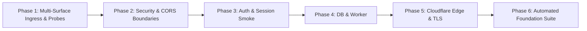

# Production Verification & Post-Deployment Testing Protocol

**Product**: Nebula Intelligence Platform (under Argonion)  
**Target Domain**: `argonion.com` (Approved Topology: `argonion.com` [Landing], `app.argonion.com` [GX], `nebula.argonion.com` [WX], `api.argonion.com` [API])  
**Status**: Repository preparation is complete. Production deployment remains blocked on GCP provisioning, DNS configuration, OAuth registration, and live verification.  
**Document Version**: 2.2.0  
**Related Decision Records**:
* [ADR-PROD-001: Domain Routing & Canonical Ingress](file:///home/swasthik-k-j/Desktop/Atlas/docs/production/decisions/ADR-PROD-001-DOMAIN-ROUTING.md) (*Status: APPROVED BY PRODUCT OWNER*)
* [ADR-PROD-002: Cloud SQL PostgreSQL Sizing & Cost Gate](file:///home/swasthik-k-j/Desktop/Atlas/docs/production/decisions/ADR-PROD-002-CLOUDSQL-SIZING.md) (*Status: PENDING COST VERIFICATION*)
* [Owner Decision Register](file:///home/swasthik-k-j/Desktop/Atlas/docs/production/OWNER-DECISIONS.md) (*Status: ACTIVE REGISTER — OD-01 APPROVED*)

---

## 1. Overview & Verification Objective

This document defines the strict, multi-phase verification protocol to be executed immediately after provisioning and deploying the Nebula platform to production. Every check produces deterministic pass/fail evidence across all approved surfaces.



---

## 2. Phase 1: Ingress & Health Probe Verification

Verify container responsiveness, process state, and dependency readiness across all approved surfaces:

```bash
# Approved Domain Configuration
export ROOT_DOMAIN="https://argonion.com"
export GX_DOMAIN="https://app.argonion.com"
export WX_DOMAIN="https://nebula.argonion.com"
export API_DOMAIN="https://api.argonion.com"

# 1. API Liveness Probe (Tests that NestJS event loop is active)
curl -s -i "${API_DOMAIN}/api/v1/health/live"
# Expected: HTTP/2 200 OK, Content-Type: application/json
# Body: {"status":"ok","timestamp":"..."}

# 2. API Readiness Probe (Tests PostgreSQL connection & worker state)
curl -s -i "${API_DOMAIN}/api/v1/health/ready"
# Expected: HTTP/2 200 OK
# Body: {"status":"ready","database":"connected","worker":"ready"}

# 3. Landing Page Root Health
curl -s -i "${ROOT_DOMAIN}/health"
# Expected: HTTP/2 200 OK, Body: "OK"

# 4. Guest Experience (GX) Sandbox Health
curl -s -i "${GX_DOMAIN}/health"
# Expected: HTTP/2 200 OK, Body: "OK"

# 5. Workspace Portal (WX) Health
curl -s -i "${WX_DOMAIN}/health"
# Expected: HTTP/2 200 OK, Body: "OK"
```

---

## 3. Phase 2: Security Headers & CORS Boundaries Verification

Verify that edge and application security headers are strictly applied and CORS properly accepts approved surfaces while rejecting untrusted origins:

```bash
# 1. Inspect HTTP Security Headers on Landing & App Surfaces
curl -s -I "${ROOT_DOMAIN}" | grep -E "(Strict-Transport-Security|X-Frame-Options|X-Content-Type-Options|Content-Security-Policy|Referrer-Policy)"
curl -s -I "${GX_DOMAIN}" | grep -E "(Strict-Transport-Security|X-Frame-Options|X-Content-Type-Options|Content-Security-Policy|Referrer-Policy)"
curl -s -I "${WX_DOMAIN}" | grep -E "(Strict-Transport-Security|X-Frame-Options|X-Content-Type-Options|Content-Security-Policy|Referrer-Policy)"

# Required Assertions:
# - Strict-Transport-Security: max-age=31536000; includeSubDomains; preload
# - X-Frame-Options: SAMEORIGIN
# - X-Content-Type-Options: nosniff
# - Referrer-Policy: strict-origin-when-cross-origin
# - Content-Security-Policy: default-src 'self'...

# 2. Test CORS Allowed Origins (Landing, GX, WX)
for ORIGIN in "${ROOT_DOMAIN}" "${GX_DOMAIN}" "${WX_DOMAIN}"; do
  echo "Testing CORS for ${ORIGIN}..."
  curl -s -I -X OPTIONS "${API_DOMAIN}/api/v1/health" \
    -H "Origin: ${ORIGIN}" \
    -H "Access-Control-Request-Method: GET" | grep -i "access-control-allow-origin"
done
# Expected: Each returns Access-Control-Allow-Origin matching the requested origin

# 3. Test CORS Rejection on Malicious Origin
curl -s -I -X OPTIONS "${API_DOMAIN}/api/v1/health" \
  -H "Origin: https://malicious-attacker.com" \
  -H "Access-Control-Request-Method: GET"
# Expected: Absence of Access-Control-Allow-Origin OR explicit 403 CORS rejection
```

---

## 4. Phase 3: Authentication & Session Smoke Verification

Verify that authentication endpoints and session cookie mechanisms function properly:

```bash
# 1. Verify Unauthenticated Protected Route Rejection on API
curl -s -o /dev/null -w "%{http_code}\n" "${API_DOMAIN}/api/v1/workspace/overview"
# Expected: HTTP 401 Unauthorized

# 2. Verify Security Disclosure File on Apex Root
curl -s "${ROOT_DOMAIN}/.well-known/security.txt"
# Expected: HTTP 200 OK containing RFC 9116 directives

# 3. Verify Robots.txt and Sitemap.xml on Apex Root
curl -s "${ROOT_DOMAIN}/robots.txt"
# Expected: Disallow directives for /admin, /workspace, /api/ and Sitemap link
curl -s "${ROOT_DOMAIN}/sitemap.xml"
# Expected: Valid XML urlset
```

---

## 5. Phase 4: Database Persistence & Worker Verification

Verify that background understanding jobs execute and write findings to Cloud SQL:

```bash
# Check Cloud Logging for API and Worker startup
gcloud logging read 'resource.type="cloud_run_revision" AND resource.labels.service_name="nebula-prod-worker"' \
  --project="${GCP_PROJECT_ID}" \
  --limit=10 \
  --format="value(textPayload)"

# Expected: "Nebula Understanding Worker runtime is active and processing background jobs."
```

---

## 6. Phase 5: Cloudflare Edge & DNS Verification

Verify SSL configuration, DNSSEC, and canonical redirects:

```bash
# 1. Verify DNSSEC signature on argonion.com
dig +dnssec argonion.com @1.1.1.1

# 2. Verify TLS 1.3 Negotiation on all subdomains
for HOST in "argonion.com" "app.argonion.com" "nebula.argonion.com" "api.argonion.com"; do
  echo "Checking TLS 1.3 on ${HOST}..."
  openssl s_client -connect ${HOST}:443 -tls1_3 </dev/null 2>&1 | grep "Protocol  : TLSv1.3"
done

# 3. Verify Canonical WWW Redirect to Apex Root
curl -s -I http://www.argonion.com | grep -E "(301 Moved Permanently|Location:)"
curl -s -I https://www.argonion.com | grep -E "(301 Moved Permanently|Location:)"
# Expected: Location: https://argonion.com/
```

---

## 7. Phase 6: Automated Foundation Verification Suite

Execute the authoritative verification script to validate all 15 acceptance criteria:

```bash
bash infra/gcp/scripts/verify-production-foundation.sh
```

**Acceptance Matrix Verified by Script:**
* [x] AC-01: Dedicated Production GCP Configuration
* [x] AC-02: Required Google Cloud APIs Defined
* [x] AC-03: Production IAM Least-Privilege Model
* [x] AC-04 & AC-05: Container Dockerfiles & Artifact Registry
* [x] AC-06: Cloud SQL PostgreSQL 17 Regional HA & PITR
* [x] AC-07 & AC-08: Prisma Schema & Migration Automation
* [x] AC-09: Secret Externalization & Isolation
* [x] AC-10: API vs Worker Execution Boundaries
* [x] AC-11: Absence of Development Dependencies in Production
* [x] AC-12: Network Security & VPC Access Connectors
* [x] AC-13: Production Architecture Documentation
* [x] AC-14: Automated Verification Test Suite
* [x] AC-15: Zero Regressions on Workspace & Finding Truth
