# Production Provisioning Master Plan

**Product**: Nebula Intelligence Platform (under Argonion)  
**Target Domain**: `argonion.com` (Approved Routing Topology per [OD-01](file:///home/swasthik-k-j/Desktop/Atlas/docs/production/OWNER-DECISIONS.md#od-01-canonical-nebula-domain-routing))  
**Document Status**: **READY FOR PROVISIONING EXECUTION (GATES CLOSED VIA PROD-001)**  
**Target Region**: `asia-south1` (Mumbai, India) per [OD-04](file:///home/swasthik-k-j/Desktop/Atlas/docs/production/OWNER-DECISIONS.md#od-04-google-cloud-production-region)  
**Selected Database**: Cloud SQL PostgreSQL 17 (Tier 2: `db-custom-1-3840`, `ZONAL`) per [OD-05](file:///home/swasthik-k-j/Desktop/Atlas/docs/production/OWNER-DECISIONS.md#od-05-cloud-sql-initial-sizing--availability)  
**Project Owner**: Swasthik K J (`swasthik@argonion.com`) per [OD-06](file:///home/swasthik-k-j/Desktop/Atlas/docs/production/OWNER-DECISIONS.md#od-06-gcp-project--billing-ownership)  
**Last Updated**: 2026-09-12  

---

## 1. Executive Summary & Objective

This document serves as the master execution blueprint for provisioning and deploying the Nebula Intelligence Platform into a live, secure, highly available, and cost-controlled production environment.

The architecture strictly follows the **documentation-first, zero-unverified-assumption** methodology:
* **Zero Infrastructure Drift**: No resources are created until all architectural decisions, cost bounds, and security boundaries are fully approved.
* **Separation of Concerns**: User web traffic, API workloads, background workers, database storage, and external edge proxies operate with dedicated least-privilege boundaries.
* **Cost Gate Compliance**: Designed to operate within Google Cloud Free Trial limits ($300 initial credits) with proactive budget alerts ($250 threshold) to prevent runaway cloud spend.

```
                                              INTERNET
                                                 │
                                                 ▼
                              [ Cloudflare Edge Proxy & DNS Zone ]
                               (TLS 1.3 Strict / WAF / DDoS / CDN)
                                                 │
             ┌───────────────────────┬───────────┴───────────┬───────────────────────┐
             │                       │                       │                       │
             ▼                       ▼                       ▼                       ▼
    [ argonion.com ]        [ app.argonion.com ]    [ nebula.argonion.com ]  [ api.argonion.com ]
   (Root Landing Page)     (Guest Experience GX)   (Workspace Portal WX)    (NestJS Backend API)
             │                       │                       │                       │
             └───────────────────────┴───────────┬───────────┘                       │
                                                 ▼                                   ▼
                                       [ nebula-prod-web ]                 [ nebula-prod-api ]
                                       (Cloud Run / Nginx)                 (Cloud Run / NestJS)
                                       - Port: 8080                        - Port: 8080
                                       - Ingress: All                      - Ingress: All
                                       - Scale: 0–10                       - Scale: 0–10
                                                                                     │
                                                                                     ▼
                                                                          [ Serverless VPC Access ]
                                                                          (nebula-vpc-conn: 10.8.0.0/28)
                                                                                     │
                                             ┌───────────────────────────────────────┴───────────────────────────────────────┐
                                             │                                                                               │
                                             ▼                                                                               ▼
                                [ nebula-prod-postgres ]                                                    [ nebula-prod-worker ]
                                (Cloud SQL PostgreSQL 17)                                                   (Cloud Run - Standalone)
                                - Private IP Only (No Public IPv4)                                          - Ingress: Internal Only
                                - Tier 2: db-custom-1-3840 (Zonal)                                          - Scale: 1–3 Instances
```

---

## 2. Frozen Architectural Boundaries & Invariants

All provisioning operations must strictly preserve the following frozen contracts:

1. **Email Platform Invariant (`EMAIL-001` → `EMAIL-010` & `AUTH-EMAIL-001`)**:
   - Inbound email routing is decoupled to **Cloudflare Email Routing** (`security@argonion.com`, `support@argonion.com`, `hello@argonion.com`). Private destination inboxes are never exposed in documentation, source code, or configuration.
   - Outbound transactional email is managed exclusively via **Resend API**. Welcome emails, verification links, and password resets use DB-backed idempotency records (`email_delivery_records`).
2. **Single Authoritative System of Record**:
   - PostgreSQL 17 via Cloud SQL is the sole source of truth. SQLite or local stores are strictly forbidden in production.
3. **Decoupled Asynchronous Processing**:
   - `nebula-prod-api`: Synchronous HTTP endpoints with `WORKER_ENABLED=false`.
   - `nebula-prod-worker`: Background scanner engine with `WORKER_ENABLED=true` and `WORKER_MODE=standalone`.
4. **Strict Least-Privilege IAM**:
   - Dedicated service accounts per service with zero shared credentials and no broad `roles/owner` or `roles/editor` grants.
5. **Zero Secret Leakage**:
   - Secrets are managed exclusively via Google Secret Manager and mounted at runtime. Zero secrets committed to git or exposed in frontend bundles.
6. **Network Isolation**:
   - Cloud SQL has no public IPv4 address. All database traffic traverses the VPC via the Serverless VPC Access connector.

---

## 3. Master Provisioning Sequence (20-Step Phased Plan)

To eliminate deployment failures and race conditions, infrastructure provisioning must proceed in the following strict order:

```mermaid
flowchart TD
    Step01["1. Confirm Owner Decisions (CLOSED)"] --> Step02["2. Create GCP Project"]
    Step02 --> Step03["3. Attach Billing & Budget Alerts"]
    Step03 --> Step04["4. Enable GCP Service APIs"]
    Step04 --> Step05["5. Provision IAM & Service Accounts"]
    Step05 --> Step06["6. Create Artifact Registry"]
    Step06 --> Step07["7. Configure VPC & Serverless Connector"]
    Step07 --> Step08["8. Provision Cloud SQL PostgreSQL 17"]
    Step08 --> Step09["9. Populate Google Secret Manager"]
    Step09 --> Step10["10. Build & Push Multi-Arch Docker Images"]
    Step10 --> Step11["11. Execute Prisma Production Migrations"]
    Step11 --> Step12["12. Deploy Cloud Run API (nebula-prod-api)"]
    Step12 --> Step13["13. Deploy Cloud Run Worker (nebula-prod-worker)"]
    Step13 --> Step14["14. Deploy Cloud Run Web (nebula-prod-web)"]
    Step14 --> Step15["15. Configure Cloud Run Custom Domains"]
    Step15 --> Step16["16. Configure Cloudflare DNS & Edge Rules"]
    Step16 --> Step17["17. Configure OAuth Consent & Callbacks"]
    Step17 --> Step18["18. Verify Resend Domain & SPF/DKIM"]
    Step18 --> Step19["19. Execute Production Verification Suite"]
    Step19 --> Step20["20. Public Launch & DNS Cutover"]
```



### Detailed Phase Breakdown

| Step | Phase Name | Governing Runbook / Reference | Key Deliverables & Validation Gates | Status |
| :--- | :--- | :--- | :--- | :--- |
| **1** | **Owner Decisions Sign-off** | [OWNER-DECISIONS.md](file:///home/swasthik-k-j/Desktop/Atlas/docs/production/OWNER-DECISIONS.md) | All 8 decisions confirmed and approved via PROD-001. | **APPROVED** |
| **2** | **GCP Project Bootstrap** | [GCP-PROJECT-BOOTSTRAP.md](file:///home/swasthik-k-j/Desktop/Atlas/docs/production/GCP-PROJECT-BOOTSTRAP.md) | Project ID `argonion-nebula-prod` created with organizational governance. | READY |
| **3** | **Billing & Budget Setup** | [GCP-PROJECT-BOOTSTRAP.md](file:///home/swasthik-k-j/Desktop/Atlas/docs/production/GCP-PROJECT-BOOTSTRAP.md) | Attach billing account; configure $250 threshold budget alert with owner email alerts. | READY |
| **4** | **API Enablement** | [GCP-PROJECT-BOOTSTRAP.md](file:///home/swasthik-k-j/Desktop/Atlas/docs/production/GCP-PROJECT-BOOTSTRAP.md) | Enable Cloud Run, Cloud SQL Admin, Secret Manager, VPC Access, Artifact Registry. | READY |
| **5** | **IAM & Service Accounts** | [GCP-PROJECT-BOOTSTRAP.md](file:///home/swasthik-k-j/Desktop/Atlas/docs/production/GCP-PROJECT-BOOTSTRAP.md) | Create `api-sa`, `worker-sa`, `deployer-sa`, `migration-sa`; apply least-privilege roles. | READY |
| **6** | **Artifact Registry** | [GCP-PROJECT-BOOTSTRAP.md](file:///home/swasthik-k-j/Desktop/Atlas/docs/production/GCP-PROJECT-BOOTSTRAP.md) | Create `nebula-docker-repo` Docker repository in `asia-south1`. | READY |
| **7** | **VPC & Serverless Access** | [PRODUCTION-FOUNDATION.md](file:///home/swasthik-k-j/Desktop/Atlas/docs/production/PRODUCTION-FOUNDATION.md) | Provision `nebula-vpc-conn` (/28 subnet) and private services access peering. | READY |
| **8** | **Cloud SQL PostgreSQL** | [ADR-PROD-002](file:///home/swasthik-k-j/Desktop/Atlas/docs/production/decisions/ADR-PROD-002-CLOUDSQL-SIZING.md) | Provision Tier 2 (`db-custom-1-3840`, `ZONAL`) with private IP, daily backups, and PITR. | READY |
| **9** | **Secret Provisioning** | [SECRET-MANAGEMENT-PLAN.md](file:///home/swasthik-k-j/Desktop/Atlas/docs/production/SECRET-MANAGEMENT-PLAN.md) | Populate Secret Manager secrets (`DATABASE_URL`, JWT secrets, OAuth, Resend API key). | READY |
| **10** | **Container Build & Push** | [DEPLOYMENT-RUNBOOK.md](file:///home/swasthik-k-j/Desktop/Atlas/docs/production/DEPLOYMENT-RUNBOOK.md) | Build rootless Alpine multi-stage images for `api`, `worker`, `web`; push to Artifact Registry. | READY |
| **11** | **Database Migration** | [DEPLOYMENT-RUNBOOK.md](file:///home/swasthik-k-j/Desktop/Atlas/docs/production/DEPLOYMENT-RUNBOOK.md) | Run `prisma migrate deploy` via Cloud Run job or migration container over private VPC. | READY |
| **12** | **Deploy Backend API** | [PRODUCTION-FOUNDATION.md](file:///home/swasthik-k-j/Desktop/Atlas/docs/production/PRODUCTION-FOUNDATION.md) | Deploy `nebula-prod-api` (Port 8080, public ingress, VPC connector, mounted secrets). | READY |
| **13** | **Deploy Background Worker** | [PRODUCTION-FOUNDATION.md](file:///home/swasthik-k-j/Desktop/Atlas/docs/production/PRODUCTION-FOUNDATION.md) | Deploy `nebula-prod-worker` (Internal ingress only, CPU allocated, worker mode standalone). | READY |
| **14** | **Deploy Frontend Web** | [PRODUCTION-FOUNDATION.md](file:///home/swasthik-k-j/Desktop/Atlas/docs/production/PRODUCTION-FOUNDATION.md) | Deploy `nebula-prod-web` (Multi-surface SPA routing: Landing, GX, WX). | READY |
| **15** | **Custom Domain Mapping** | [CLOUDFLARE-DNS-PLAN.md](file:///home/swasthik-k-j/Desktop/Atlas/docs/production/CLOUDFLARE-DNS-PLAN.md) | Map Cloud Run domain mappings for `argonion.com`, `app`, `nebula`, `api`. | READY |
| **16** | **Cloudflare DNS & Edge** | [CLOUDFLARE-DNS-PLAN.md](file:///home/swasthik-k-j/Desktop/Atlas/docs/production/CLOUDFLARE-DNS-PLAN.md) | Configure CNAME records, SSL Full (Strict), HSTS, DMARC, CAA, DNSSEC, Email Routing. | READY |
| **17** | **OAuth Provider Registration** | [OAUTH-PRODUCTION-PLAN.md](file:///home/swasthik-k-j/Desktop/Atlas/docs/production/OAUTH-PRODUCTION-PLAN.md) | Register Google and GitHub OAuth applications with production callback URLs. | READY |
| **18** | **Resend Domain Verification** | [RESEND-PRODUCTION-PLAN.md](file:///home/swasthik-k-j/Desktop/Atlas/docs/production/RESEND-PRODUCTION-PLAN.md) | Verify domain sending records in Resend; test transactional email delivery. | READY |
| **19** | **Production Verification** | [PRODUCTION-VERIFICATION.md](file:///home/swasthik-k-j/Desktop/Atlas/docs/production/PRODUCTION-VERIFICATION.md) | Execute end-to-end smoke verification, health checks, auth flow, and scan tests. | READY |
| **20** | **Public Launch Gate** | [LAUNCH-READINESS-MASTER-CHECKLIST.md](file:///home/swasthik-k-j/Desktop/Atlas/docs/production/LAUNCH-READINESS-MASTER-CHECKLIST.md) | Final sign-off by Swasthik K J; transition from staged launch to public availability. | READY |

---

## 4. Regional Commitment: `asia-south1` (Mumbai, India)

Per [ADR-PROD-004](file:///home/swasthik-k-j/Desktop/Atlas/docs/production/decisions/ADR-PROD-004-DEPLOYMENT-REGION.md) and [OD-04](file:///home/swasthik-k-j/Desktop/Atlas/docs/production/OWNER-DECISIONS.md#od-04-google-cloud-production-region), the approved primary region is **`asia-south1` (Mumbai, India)**.

### Regional Verification Summary
1. **Cloud Run Availability**: Gen2 execution environment and custom domain mappings verified supported.
2. **Cloud SQL Availability**: PostgreSQL 17 engine availability verified on Tier 2 (`db-custom-1-3840`).
3. **Serverless VPC Access**: VPC connector throughput and IP range allocation verified supported (`10.8.0.0/28`).
4. **Artifact Registry**: Regional Docker repository supported in `asia-south1`.
5. **Latency Advantage**: Delivers 15–35ms sub-second response times for South Asian and Indian users.

---

## 5. Cloud SQL PostgreSQL Architecture & Sizing

Per [ADR-PROD-002](file:///home/swasthik-k-j/Desktop/Atlas/docs/production/decisions/ADR-PROD-002-CLOUDSQL-SIZING.md) and [OD-05](file:///home/swasthik-k-j/Desktop/Atlas/docs/production/OWNER-DECISIONS.md#od-05-cloud-sql-initial-sizing--availability), database provisioning is approved under **Tier 2**:

* **Machine Tier**: `db-custom-1-3840` (1 vCPU, 3.75 GB RAM)
* **Storage**: Initial 10 GB SSD with `disk_autoresize = true` (auto-expanding)
* **Availability**: `ZONAL` (Single-zone to conserve $300 Free Trial runway; HA deferred)
* **Automated Backups**: Daily backup window at `02:00 UTC` with 7-day retention
* **Point-in-Time Recovery (PITR)**: Write-Ahead Log (WAL) retention enabled for 7 days
* **Deletion Protection**: `deletion_protection = true` enabled in Terraform and GCP Console
* **Maintenance Window**: Scheduled for Sundays at `03:00 UTC` with `order = "after_work_hours"`
* **Network Binding**: Private IP only (`ipv4_enabled = false`) via Serverless VPC Access
* **Estimated Monthly Baseline**: ~$45.00 – $55.00 / month

---

## 6. Cloud Run Services Topology & Configuration

| Service Name | Primary Role | Ingress Setting | Min / Max Instances | CPU / RAM | Port | Health Check Path |
| :--- | :--- | :--- | :--- | :--- | :--- | :--- |
| **`nebula-prod-api`** | Backend NestJS REST API | `all` (Public via Edge) | 0 / 10 | 1.0 vCPU / 512 MiB | 8080 | `/api/v1/health` |
| **`nebula-prod-worker`** | Asynchronous Discovery Worker | `internal` (No Public Ingress) | 1 / 3 | 1.0 vCPU / 1024 MiB | 8080 | Internal polling loop |
| **`nebula-prod-web`** | Multi-surface Frontend (SPA) | `all` (Public via Edge) | 0 / 10 | 0.5 vCPU / 256 MiB | 8080 | `/healthz` |

### Rollback Strategy
If any deployment fails verification:
```bash
# Roll back Cloud Run service immediately to the previous healthy revision
gcloud run services update-traffic nebula-prod-api \
  --to-revisions=PREVIOUS_REVISION=100 \
  --region=asia-south1
```

---

## 7. Supporting Plan Documents

For granular operational steps, refer to the individual specialized plans:

* [GCP-PROJECT-BOOTSTRAP.md](file:///home/swasthik-k-j/Desktop/Atlas/docs/production/GCP-PROJECT-BOOTSTRAP.md): Project creation, billing, APIs, IAM, and Artifact Registry.
* [CLOUDFLARE-DNS-PLAN.md](file:///home/swasthik-k-j/Desktop/Atlas/docs/production/CLOUDFLARE-DNS-PLAN.md): DNS records, Cloudflare Email Routing, SSL/TLS, and Edge security.
* [SECRET-MANAGEMENT-PLAN.md](file:///home/swasthik-k-j/Desktop/Atlas/docs/production/SECRET-MANAGEMENT-PLAN.md): Secret inventory, Secret Manager setup, and anti-leakage invariants.
* [OAUTH-PRODUCTION-PLAN.md](file:///home/swasthik-k-j/Desktop/Atlas/docs/production/OAUTH-PRODUCTION-PLAN.md): Google & GitHub OAuth app registration and callback endpoints.
* [RESEND-PRODUCTION-PLAN.md](file:///home/swasthik-k-j/Desktop/Atlas/docs/production/RESEND-PRODUCTION-PLAN.md): Outbound transactional email configuration and domain verification.
* [PROVISIONING-CHECKLIST.md](file:///home/swasthik-k-j/Desktop/Atlas/docs/production/PROVISIONING-CHECKLIST.md): Step-by-step master execution checklist with go/no-go gates.
* [PREP-005-EVIDENCE.md](file:///home/swasthik-k-j/Desktop/Atlas/docs/production/evidence/PREP-005-EVIDENCE.md): Formal verification evidence for preparation phase.
