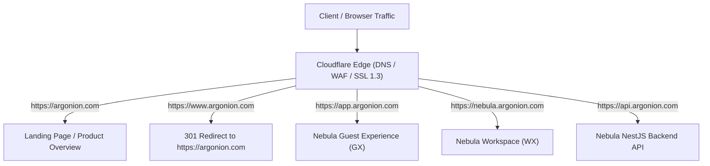

# ADR-PROD-001: Domain Routing & Canonical Ingress Topology

**Status**: APPROVED  
**Decision Date**: 2026-09-12  
**Decider**: Product Owner  
**Scope**: Production domain routing, subdomain architecture, GX vs WX separation, CORS whitelist, OAuth redirect URIs  

---

## 1. Context & Problem Statement

The production apex domain `argonion.com` is registered through GoDaddy with authoritative nameservers delegated to Cloudflare. The platform encompasses multiple user surfaces:
1. Public Marketing & Corporate Landing
2. Guest Experience (GX) for friction-free exploration and single-domain intelligence
3. Workspace (WX) for authenticated multi-tenant workspace intelligence and collaboration
4. Authoritative NestJS Backend API Engine (`apps/api`)

To preserve clean security boundaries, isolate user session state, optimize SEO, and support independent scaling, the Product Owner has finalized and approved the definitive domain routing topology.

---

## 2. Approved Canonical Ingress Topology



### Approved Routing Table

| Hostname | Role / Target Surface | Hosting Target | Verification / Purpose |
|---|---|---|---|
| **`argonion.com`** | **Argonion / Nebula Landing Page** | Google Cloud Run (`nebula-prod-web`) | Marketing, product overview, documentation, legal policies (`/privacy`, `/terms`), and `/.well-known/security.txt`. |
| **`www.argonion.com`** | **Canonical WWW Redirect** | Cloudflare Page / Redirect Rule | Enforces canonical apex destination (`301 Permanent Redirect` to `https://argonion.com`). |
| **`app.argonion.com`** | **Nebula Guest Experience (GX)** | Google Cloud Run (`nebula-prod-web` / GX mode) | Frictionless, unauthenticated intelligence surface for immediate single-domain discovery and infrastructure overview. |
| **`nebula.argonion.com`** | **Nebula Workspace (WX)** | Google Cloud Run (`nebula-prod-web` / WX mode) | Authenticated SaaS workspace portal for teams, multi-domain inventory, deep findings, memory graph, and forensic analytics. |
| **`api.argonion.com`** | **Nebula Authoritative API Engine** | Google Cloud Run (`nebula-prod-api`) | Core NestJS backend serving both GX and WX operations, authentication, rate limiting, and PostgreSQL persistence. |

---

## 3. Separation of Guest Experience (GX) & Workspace (WX)

The architectural separation between `app.argonion.com` (GX) and `nebula.argonion.com` (WX) establishes strict domain and session boundaries:

1. **Guest Experience (`app.argonion.com`)**:
   - Designed for zero-barrier exploration where visitors evaluate infrastructure intelligence capabilities without registration.
   - Operates in guest mode, reading from discovery and health endpoints.
   - Preserves client-side ephemeral state without polluting production tenant databases.
2. **Workspace Experience (`nebula.argonion.com`)**:
   - The primary authenticated enterprise application where users log in via OAuth 2.0 or Email/Password + WebAuthn.
   - Enforces multi-tenant authorization guards (`AdminAuthorizationGuard`, `JwtAuthGuard`).
   - Manages persistent domain monitors, forensic evidence graphs, and collaborative team settings.
3. **Landing Page (`argonion.com`)**:
   - Provides canonical brand presence, product storytelling, and clear call-to-actions ("Try Guest Sandbox" → `app.argonion.com` | "Sign In to Workspace" → `nebula.argonion.com`).

---

## 4. Security, CORS & OAuth Specifications

### Cross-Origin Resource Sharing (CORS) Whitelist
The NestJS API (`api.argonion.com`) enforces an explicit CORS origin whitelist configured in `apps/api/src/main.ts` with `CORS_ALLOWED_ORIGINS`:
```
https://argonion.com,https://app.argonion.com,https://nebula.argonion.com
```

### OAuth 2.0 Production Redirect URIs
Authentication redirect callbacks are strictly consolidated under the authoritative API host:
* **Google OAuth 2.0**: `https://api.argonion.com/api/v1/auth/google/callback`
* **GitHub OAuth 2.0**: `https://api.argonion.com/api/v1/auth/github/callback`

### Session Cookie Boundaries
* Authentication refresh tokens and session identifiers are delivered with `httpOnly: true`, `secure: true`, and `sameSite: 'lax'`.
* Cookies may be partitioned or host-scoped to `nebula.argonion.com` for authenticated WX sessions, preventing unauthorized cross-subdomain access from guest sessions.

---

## 5. DNS & Cloudflare Configuration Actions

When external infrastructure provisioning begins, the following Cloudflare DNS records will be added:

```dns
;; CNAME Records for Cloud Run Ingress (Proxied through Cloudflare)
argonion.com.          CNAME  ghs.googlehosted.com.  (Proxy: ON)
app.argonion.com.      CNAME  ghs.googlehosted.com.  (Proxy: ON)
nebula.argonion.com.   CNAME  ghs.googlehosted.com.  (Proxy: ON)
api.argonion.com.      CNAME  ghs.googlehosted.com.  (Proxy: ON)

;; Canonical 301 Redirect Rule in Cloudflare
http*://www.argonion.com/* -> https://argonion.com/$1 (301 Permanent Redirect)
```

---

## 6. Decision Status & Confirmation

**Status**: **APPROVED BY PRODUCT OWNER**  
**Resolution**: The canonical routing topology is permanently ratified as specified. Unresolved decision flags for domain routing are removed across all production documentation.
