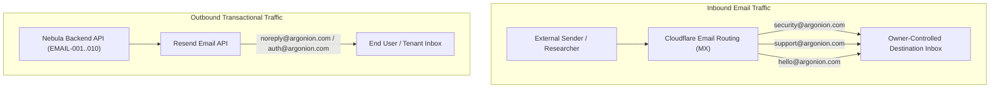

# ADR-PROD-003: Inbound Email Routing & Outbound Transactional Architecture

**Status**: APPROVED  
**Decision Date**: 2026-09-12  
**Decider**: Product Owner  
**Scope**: Inbound email forwarding, destination aliases, SPF/DKIM/DMARC alignment, and transactional sending boundaries  

---

## 1. Context & Problem Statement

The Nebula platform under Argonion requires operational communication channels for:
1. Public vulnerability disclosures (`/.well-known/security.txt`).
2. User support inquiries and platform assistance.
3. General business inquiries and corporate communications.
4. Transactional outbound email notifications (auth magic links, alerts, system notifications).

Traditional corporate mail hosting (e.g., Google Workspace or Microsoft 365) introduces recurring per-seat monthly costs that are unnecessary for early-stage forwarding needs. A cost-effective, zero-maintenance email architecture is required that preserves destination inbox privacy while guaranteeing high email deliverability.

---

## 2. Approved Email Architecture



### 1. Inbound Routing: Cloudflare Email Routing (Approved)
Inbound email for the domain `argonion.com` is handled exclusively by **Cloudflare Email Routing**:
* Zero cost ($0/mo) integrated directly with Cloudflare DNS.
* Inbound MX records point to Cloudflare edge mail exchangers (`route1.mx.cloudflare.net`, `route2.mx.cloudflare.net`, `route3.mx.cloudflare.net`).
* All inbound mail is parsed, verified against SPF/DKIM/DMARC, and forwarded transparently to the Product Owner's private destination inbox.

### 2. Inbound Alias Directory

| Public Alias | Primary Purpose | Forwarding Destination | Target SLA |
|---|---|---|---|
| **`security@argonion.com`** | RFC 9116 Vulnerability Disclosure & Incident Alerts | Owner-controlled destination inbox | Initial response within 24–48 hours |
| **`support@argonion.com`** | Customer Support, Account Assistance, Terms Inquiry | Owner-controlled destination inbox | Initial response within 24 hours |
| **`hello@argonion.com`** | General Partnerships, Media, Corporate Contact | Owner-controlled destination inbox | Best effort |

> [!IMPORTANT]
> **Privacy Invariant**: The actual destination inbox address (e.g., personal Gmail / administrative address) MUST NOT be committed to git, documented in public files, baked into container images, or exposed via frontend environment variables.

---

## 3. Outbound Transactional Email Architecture

Outbound transactional email delivery is completely decoupled from inbound forwarding:
* **Sending Engine**: Handled via the Resend API conforming strictly to the frozen `EMAIL-001` → `EMAIL-010` platform architecture.
* **Sending Identities**: `notifications@argonion.com`, `auth@argonion.com`, or `noreply@argonion.com`.
* **DNS Deliverability Hardening**:
  * **SPF**: TXT record combining Cloudflare forwarding authorization and Resend sending authorization:
    ```dns
    v=spf1 include:_spf.mx.cloudflare.net include:resend.com ~all
    ```
  * **DKIM**: 3x CNAME records provided by Resend for 2048-bit cryptographic message signing.
  * **DMARC**: Strict domain alignment policy published at `_dmarc.argonion.com`:
    ```dns
    v=DMARC1; p=none; rua=mailto:dmarc-reports@argonion.com; adkim=r; aspf=r
    ```

---

## 4. Operational Cost Comparison

| Dimension | Dedicated Workspace / Proton | Cloudflare Email Routing + Resend |
|---|---|---|
| **Monthly Compute / Seat Cost** | ~$6–$18 / user / month | **$0 / month** (included in free tier) |
| **Outbound Email Free Tier** | 0 (paid subscription required) | **3,000 emails/month free** (Resend Free Tier) |
| **DNS Maintenance Overhead** | Separate DNS records & admin console | Native Cloudflare 1-click MX record configuration |
| **Spam / Threat Protection** | Provider-managed | Cloudflare edge spam filtering & SPF enforcement |

---

## 5. Decision Status & Approvals

**Status**: **APPROVED BY PRODUCT OWNER**  
**Resolution**: Inbound mail routing via Cloudflare Email Routing is permanently ratified. Google Workspace and Proton Mail references are retired.
