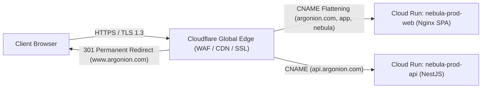

# ADR-PROD-005: Authoritative Edge Strategy & Proxy Topology

**Status**: APPROVED / RECOMMENDED  
**Decision Date**: 2026-09-12  
**Decider**: Product Owner / Technical Lead  
**Scope**: Ingress edge proxy, SSL termination, DDoS protection, CDN caching, and container proxy consolidation  

---

## 1. Context & Problem Statement

The repository contains three competing proxy and ingress configurations:
1. `docker/Caddyfile`: Standalone Caddy reverse proxy with automatic ACME TLS.
2. `docker/nginx-edge.conf`: Nginx edge reverse proxy with custom rate limiting.
3. `docker/nginx.conf`: Internal static file server for the React SPA container.

In a modern serverless deployment on Google Cloud Run paired with Cloudflare authoritative DNS, running a dedicated virtual machine or redundant container for reverse proxying introduces unnecessary compute costs, additional failure points, and network latency.

---

## 2. Approved Strategy: Cloudflare Edge + Cloud Run Native Ingress

### Architecture Details:
1. **Cloudflare Global Edge**:
   - **DNS**: Authoritative zone management and CNAME flattening for apex and subdomains.
   - **SSL/TLS**: Universal SSL with **Full (Strict)** mode and TLS 1.3 enforcement.
   - **Canonical Redirect**: Edge Page/Redirect Rule executing immediate 301 redirect from `www.argonion.com` to `https://argonion.com`.
   - **DDoS & WAF**: Managed rulesets and bot protection at Layer 7.
   - **Email Routing**: Inbound email forwarding for `security@`, `support@`, and `hello@argonion.com`.
2. **Google Cloud Run Native Ingress**:
   - Cloud Run natively manages HTTPS termination, autoscaling (0–10 instances), and custom domain certificate mapping via Google Front End (GFE) / `ghs.googlehosted.com`.
3. **Internal Container Server**:
   - `docker/nginx.conf` acts strictly as an internal HTTP/1.1 static file server inside the `nebula-prod-web` container, serving pre-built React SPA assets with gzip compression and client-side SPA routing fallback.
4. **Retired Proxies**:
   - `docker/Caddyfile` and `docker/nginx-edge.conf` are retained for local offline container cluster testing only, but are **not deployed** to production.

---

## 3. Benefits & Trade-Offs

| Metric | Cloudflare + Cloud Run Native | Dedicated VM Proxy (Caddy/Nginx) |
|---|---|---|
| **Monthly Compute Cost** | **$0.00** (Native Cloud Run ingress) | ~$15 – $40 / mo (VM instance) |
| **Maintenance Overhead** | **Zero** (Serverless Google-managed) | High (OS updates, certificate renewal, patching) |
| **Latency** | **Direct routing to Cloud Run** | +1 Network Hop through VM proxy |
| **Availability SLA** | **99.95% (Google Cloud SLA)** | Single VM failure risk |

---

## 4. Decision Status & Approvals

**Status**: **APPROVED BY PRODUCT OWNER / RECOMMENDED**  
**Resolution**: Option A (Cloudflare + Cloud Run Native Ingress) is designated as the authoritative production edge topology.
