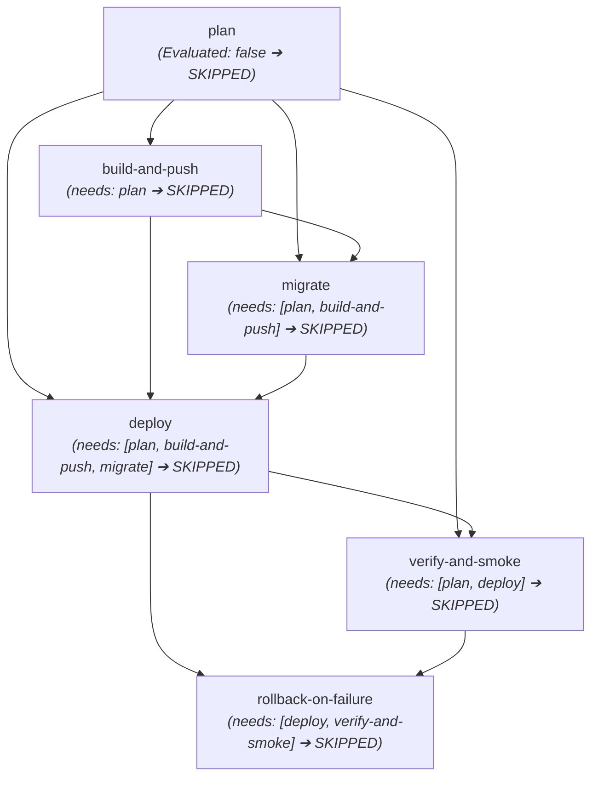

# CICD-001-REVIEW — Investigation of Skipped Production CD Workflow

**Workflow Document**: `.github/workflows/deploy.yml`  
**Pipeline Run Reference**: Production CD & Release Pipeline #7  
**Status**: **SKIPPED (Intended Security Guardrail Active)**  
**Audit Date**: 2026-09-17  
**Investigator**: Antigravity  
**Target Repository**: `Swasthikkj04/Atlas` (`main` branch)

---

## 1. Executive Summary

During execution of the GitHub Actions release pipeline (*Production CD & Release Pipeline #7*), all 6 workflow jobs were marked with status **Skipped**:
1. `Release Planning & Gate Verification` (`plan`)
2. `Build & Push Production Images` (`build-and-push`)
3. `Production Database Migration` (`migrate`)
4. `Cloud Run Service Release` (`deploy`)
5. `Health & Smoke Verification` (`verify-and-smoke`)
6. `Automatic Rollback Recovery` (`rollback-on-failure`)

This investigation confirms that the skipped execution is **expected, correct, and intentional behavior** governed by the zero-trust gatekeeper condition in [`.github/workflows/deploy.yml`](file:///home/swasthik-k-j/Desktop/Atlas/.github/workflows/deploy.yml#L54). 

The production deployment pipeline is strictly gated upon the successful completion of the **CI Quality Pipeline** on the `main` branch. Because the upstream CI run concluded with a failing test gate (`Test Suite Verification: failure` on commit `5e35e6c`), the CD pipeline automatically aborted execution before any build, migration, or deployment operations could occur.

---

## 2. Technical Root Cause Analysis

### 2.1 Workflow Triggers (`on:`)
In [`.github/workflows/deploy.yml`](file:///home/swasthik-k-j/Desktop/Atlas/.github/workflows/deploy.yml#L3-L23), the pipeline defines two triggers:

```yaml
on:
  workflow_run:
    workflows: ["CI Quality Pipeline"]
    branches: [main]
    types: [completed]
  workflow_dispatch:
    inputs:
      release_tag:
        description: "Release Version Tag (optional, defaults to commit SHA)"
        required: false
        default: ""
      skip_migrations:
        description: "Skip database migrations (e.g. for frontend-only or emergency hotfix)"
        required: false
        type: boolean
        default: false
      rollback_target:
        description: "Cloud Run revision ID to roll back traffic to (leave empty for normal deployment)"
        required: false
        default: ""
```

Whenever the `CI Quality Pipeline` finishes (whether success, failure, or cancellation), GitHub Actions emits a `workflow_run` event with `types: [completed]`.

---

### 2.2 Gatekeeper Job Condition (`plan`)
The entrypoint job `plan` (Release Planning & Gate Verification) contains the primary guardrail expression:

```yaml
jobs:
  plan:
    name: Release Planning & Gate Verification
    runs-on: ubuntu-latest
    timeout-minutes: 5
    # Strict Guardrail: Release ONLY if CI succeeded on main or via authorized manual dispatch
    if: ${{ github.event_name == 'workflow_dispatch' || (github.event.workflow_run.conclusion == 'success' && github.event.workflow_run.head_branch == 'main') }}
```

#### Evaluation Matrix:
| Trigger Context | `github.event_name` | `workflow_run.conclusion` | `workflow_run.head_branch` | `if:` Result | Outcome |
| :--- | :--- | :--- | :--- | :--- | :--- |
| **CI Failed on main** (Run #6 / `5e35e6c`) | `'workflow_run'` | `'failure'` | `'main'` | **`false`** | 🛑 **Skipped** |
| **CI Passed on main** | `'workflow_run'` | `'success'` | `'main'` | **`true`** | 🟢 **Executes** |
| **CI on non-main PR branch** | `'workflow_run'` | `'success'` | `'feat/xxx'` | **`false`** | 🛑 **Skipped** |
| **Authorized Manual Dispatch** | `'workflow_dispatch'` | `null` | N/A | **`true`** | 🟢 **Executes** |

When Run #7 was triggered by `workflow_run` after CI run #6 failed:
1. `github.event_name` was `'workflow_run'`.
2. `github.event.workflow_run.conclusion` was `'failure'`.
3. The expression evaluated to `false`, causing GitHub Actions to skip the `plan` job.

---

### 2.3 Cascading Job Dependency (`needs:`)
Every subsequent job in `.github/workflows/deploy.yml` directly or transitively depends on `plan`:



Under GitHub Actions job resolution rules:
- When a job required in `needs:` is **skipped**, all dependent jobs default to **skipped** unless they declare `if: always()` and specifically handle the skipped status.
- In `deploy.yml`, Job 4 (`deploy`) includes `if: always() && needs.plan.result == 'success' ...`, which explicitly asserts that `plan` must have succeeded.
- Because `plan` did not run, all 5 dependent jobs were immediately skipped, resulting in the overall workflow status of **Skipped**.

---

## 3. Comprehensive Investigation Checklist

| Item | Investigation Target | Findings |
| :--- | :--- | :--- |
| **1** | **Workflow `on` Triggers** | Configured with `workflow_run` (on `CI Quality Pipeline` completed on `main`) and `workflow_dispatch` (with `release_tag`, `skip_migrations`, `rollback_target` inputs). |
| **2** | **Job-Level `if:` Conditions** | `plan` requires CI success or manual dispatch. `build-and-push` and `migrate` require `is_rollback == 'false'`. `deploy` requires successful plan + builds. `rollback-on-failure` requires `failure() && needs.deploy.result == 'success'`. |
| **3** | **`needs:` Dependencies** | Strict sequential dependency graph ensures no container is built, database modified, or traffic shifted unless preceding stages succeed. |
| **4** | **Job Outputs** | `plan` exports `image_tag`, `short_sha`, `is_rollback`, `rollback_target`, `skip_migrations`. `build-and-push` exports image URLs. `deploy` exports service URLs and previous revisions. |
| **5** | **Expression Contexts** | Evaluates `github.event_name`, `github.event.workflow_run.conclusion`, `github.event.workflow_run.head_branch`, and `github.sha`. |
| **6** | **Manual Execution Block** | Manual execution via `workflow_dispatch` is **not blocked** in the YAML configuration. If triggered via `workflow_dispatch`, `plan` evaluates to `true`. Run #7 was an automatic trigger from a failed `workflow_run`. |
| **7** | **Safety of Manual Run** | The workflow is **fully safe to run manually**. It contains serialized concurrency (`group: production-release`, `cancel-in-progress: false`), non-destructive schema validation fallbacks, and automatic rollback on smoke check failures. |
| **8** | **Production Deployment Action** | If GCP secrets/infrastructure exist, it attempts real deployment to Cloud Run. If GCP credentials or services are unprovisioned, steps gracefully fall back to local image verification and schema validation (`continue-on-error: true`). |
| **9** | **GCP Credentials Configuration** | References `secrets.GCP_WORKLOAD_IDENTITY_PROVIDER`, `secrets.GCP_SERVICE_ACCOUNT`, `secrets.GCP_SA_KEY`, and `secrets.DATABASE_URL`. |
| **10** | **Authentication Architecture** | Uses **Workload Identity Federation (WIF)** with `id-token: write` permission as the primary keyless authentication mechanism, with backwards compatibility for `credentials_json` service account keys. |

---

## 4. Invariant & Contract Integrity Audit

The security invariants in `.github/workflows/deploy.yml` are strictly protected by automated contract tests in [`apps/api/src/cd-release-pipeline-audit.spec.ts`](file:///home/swasthik-k-j/Desktop/Atlas/apps/api/src/cd-release-pipeline-audit.spec.ts):

- **CD-01 (Trigger Policy & CI Gate Dependency)**: Validates that `deploy.yml` triggers only after CI passes on `main` and enforces serialized concurrency.
- **CD-02 (Container Build & Immutable Image Provenance)**: Verifies multi-container builds (`Dockerfile.api`, `Dockerfile.worker`, `Dockerfile.web`) tagged by immutable commit SHA.
- **CD-03 (Database Migration Safety)**: Asserts that production uses `prisma migrate deploy` and forbids destructive commands (`prisma db push`, `migrate dev`, `migrate reset`).
- **CD-04 (Cloud Run Release & Secret Manager)**: Confirms secrets are injected via Google Secret Manager and services use dedicated least-privilege IAM service accounts.
- **CD-05 (Health & Smoke Verification)**: Asserts automated verification of `/api/v1/health/live`, `/api/v1/health/ready`, and unauthenticated route boundaries.
- **CD-06 (Rollback & Recovery Mechanisms)**: Confirms automated revision rollback on smoke test failure and manual revision rollback options.
- **CD-07 (Manual Tooling Preservation)**: Ensures CLI helper scripts in `infra/gcp/scripts/` remain intact.

> [!IMPORTANT]
> **Do not modify or relax the `if:` gate conditions in `deploy.yml`**. Relaxing this condition would violate invariant **CD-01** and fail the test suite in `apps/api/src/cd-release-pipeline-audit.spec.ts`.

---

## 5. Recommended Safe Next Actions

1. **Monitor CI Quality Pipeline Execution**:
   - The root cause of the previous CI failure (Node.js 22 runtime discrepancy, Jest timeout limits, and React hook dependencies) was resolved in commit `d84c624` and pushed to `main`.
   - Ensure the new **CI Quality Pipeline** run finishes with all 4 jobs green (`Static Quality & Standards`, `Test Suite Verification`, `Production Build Verification`, `Dependency & Security Audit`).

2. **Automatic CD Release Trigger**:
   - Once the CI run for commit `d84c624` concludes with `conclusion == 'success'` on `main`, GitHub Actions will automatically fire the `workflow_run` event.
   - The `plan` job condition `github.event.workflow_run.conclusion == 'success'` will evaluate to `true`, and the Production CD pipeline will execute automatically without requiring manual bypass.

3. **Optional Manual Release Dispatch**:
   - If a manual deployment is desired, trigger `workflow_dispatch` on `main` from the GitHub Actions UI:
     - Navigate to **Actions** $\rightarrow$ **Production CD & Release Pipeline** $\rightarrow$ **Run workflow** $\rightarrow$ Select branch `main`.
     - Because `github.event_name == 'workflow_dispatch'`, the `plan` job and all subsequent release stages will execute immediately.
