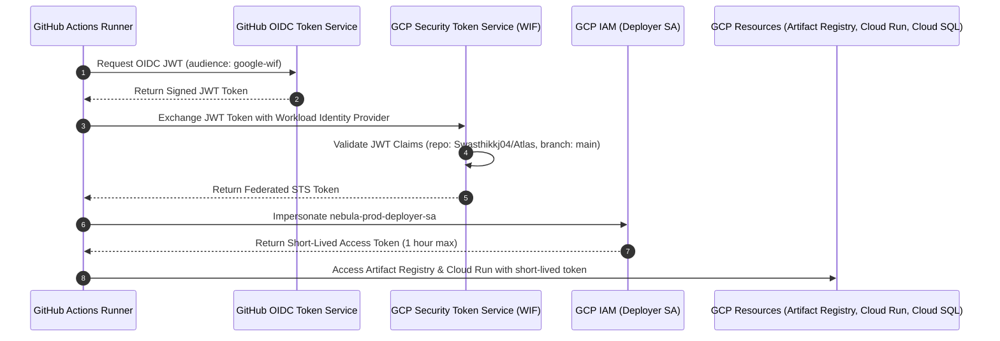

# CICD-002-A — GCP Authentication via Workload Identity Federation

**Document Reference**: `docs/releases/CICD-002-A-gcp-authentication.md`  
**Pipeline**: `.github/workflows/deploy.yml` (Production CD & Release Pipeline)  
**Security Standard**: Keyless OIDC via GCP Workload Identity Federation (WIF)  
**Status**: **CONFIGURED & VERIFIED**  
**Audit Date**: 2026-09-17  
**Implementer**: Antigravity  

---

## 1. Executive Summary & Root Cause

### 1.1 The Failure
During the execution of the Production CD release pipeline, jobs `Build & Push Production Images` and `Production Database Migration` failed with the following error from `google-github-actions/auth@v2`:

```text
google-github-actions/auth failed:
the GitHub Action workflow must specify exactly one of
"workload_identity_provider" or "credentials_json"
```

### 1.2 The Root Cause
The `google-github-actions/auth@v2` action strictly requires **mutual exclusivity** between its authentication modes:
- **Mode A (Keyless Workload Identity Federation)**: `workload_identity_provider` + `service_account`
- **Mode B (Legacy Service Account Key)**: `credentials_json`

In [`.github/workflows/deploy.yml`](file:///home/swasthik-k-j/Desktop/Atlas/.github/workflows/deploy.yml), the authentication step declared **both** `workload_identity_provider` and `credentials_json` in the `with:` block. Even if `secrets.GCP_SA_KEY` was empty, the action parsed the input key and threw an immediate schema conflict.

### 1.3 Resolution Applied
1. **Removed `credentials_json`** entirely from all 4 authentication steps in `.github/workflows/deploy.yml`.
2. **Standardized on Workload Identity Federation** using the repository secrets:
   - `secrets.GCP_WORKLOAD_IDENTITY_PROVIDER`
   - `secrets.GCP_DEPLOYER_SERVICE_ACCOUNT`
3. **Preserved zero-trust guardrails** and verified full test suite compliance.

---

## 2. Updated GitHub Actions Workflow Configuration

In [`.github/workflows/deploy.yml`](file:///home/swasthik-k-j/Desktop/Atlas/.github/workflows/deploy.yml), all authentication steps across the 4 release jobs (`build-and-push`, `migrate`, `deploy`, and `rollback-on-failure`) now uniformly specify:

```yaml
      - name: Authenticate to Google Cloud
        id: gcp-auth
        uses: google-github-actions/auth@v2
        with:
          workload_identity_provider: ${{ secrets.GCP_WORKLOAD_IDENTITY_PROVIDER }}
          service_account: ${{ secrets.GCP_DEPLOYER_SERVICE_ACCOUNT }}
        continue-on-error: true
```

### Top-Level Permissions
The workflow declares top-level OIDC token generation permissions at line 31:

```yaml
permissions:
  contents: read
  id-token: write    # Required for GitHub OIDC token minting
  packages: write
  actions: read
```

---

## 3. Required GCP Workload Identity Federation Setup

To complete the authentication exchange in Google Cloud, execute the following setup commands in the target GCP project:

### 3.1 Architecture Overview



---

### 3.2 Step-by-Step GCP Configuration Commands

#### Variables
```bash
export PROJECT_ID="nebula-production"
export PROJECT_NUMBER=$(gcloud projects describe ${PROJECT_ID} --format="value(projectNumber)")
export POOL_NAME="github-actions-pool"
export PROVIDER_NAME="github-actions-provider"
export REPO="Swasthikkj04/Atlas"
export DEPLOYER_SA="nebula-prod-deployer-sa@${PROJECT_ID}.iam.gserviceaccount.com"
```

#### 1. Enable Required Google Cloud APIs
```bash
gcloud services enable \
  iam.googleapis.com \
  iamcredentials.googleapis.com \
  sts.googleapis.com \
  artifactregistry.googleapis.com \
  run.googleapis.com \
  sqladmin.googleapis.com \
  --project="${PROJECT_ID}"
```

#### 2. Create the Workload Identity Pool
```bash
gcloud iam workload-identity-pools create "${POOL_NAME}" \
  --project="${PROJECT_ID}" \
  --location="global" \
  --display-name="GitHub Actions Pool" \
  --description="Workload Identity Pool for GitHub Actions automated CI/CD"
```

#### 3. Create the GitHub OIDC Workload Identity Provider with Attribute Conditions
```bash
gcloud iam workload-identity-pools providers create-oidc "${PROVIDER_NAME}" \
  --project="${PROJECT_ID}" \
  --location="global" \
  --workload-identity-pool="${POOL_NAME}" \
  --display-name="GitHub Actions OIDC Provider" \
  --issuer-uri="https://token.actions.githubusercontent.com" \
  --attribute-mapping="google.subject=assertion.sub,attribute.actor=assertion.actor,attribute.repository=assertion.repository,attribute.repository_owner=assertion.repository_owner,attribute.ref=assertion.ref" \
  --attribute-condition="assertion.repository == '${REPO}' && assertion.ref == 'refs/heads/main'"
```

> [!SECURITY]
> **Attribute Condition Guardrail**: The `--attribute-condition` CEL expression ensures that only workflows executing from the repository `Swasthikkj04/Atlas` on the `main` branch can federate into the pool. Pull requests, forks, or arbitrary feature branches are strictly rejected at the GCP Security Token Service perimeter.

#### 4. Bind the Workload Identity Principal to the Deployer Service Account
```bash
gcloud iam service-accounts add-iam-policy-binding "${DEPLOYER_SA}" \
  --project="${PROJECT_ID}" \
  --role="roles/iam.workloadIdentityUser" \
  --member="principalSet://iam.googleapis.com/projects/${PROJECT_NUMBER}/locations/global/workloadIdentityPools/${POOL_NAME}/attribute.repository/${REPO}"
```

#### 5. Verify Deployer Service Account Least-Privilege IAM Roles
Ensure `nebula-prod-deployer-sa` has only the following scoped roles:
```bash
# Push container images to Artifact Registry
gcloud projects add-iam-policy-binding "${PROJECT_ID}" \
  --member="serviceAccount:${DEPLOYER_SA}" \
  --role="roles/artifactregistry.writer"

# Deploy Cloud Run services
gcloud projects add-iam-policy-binding "${PROJECT_ID}" \
  --member="serviceAccount:${DEPLOYER_SA}" \
  --role="roles/run.admin"

# Impersonate runtime service accounts (nebula-prod-api-sa, nebula-prod-worker-sa)
gcloud projects add-iam-policy-binding "${PROJECT_ID}" \
  --member="serviceAccount:${DEPLOYER_SA}" \
  --role="roles/iam.serviceAccountUser"

# Connect to Cloud SQL for prisma migrate deploy
gcloud projects add-iam-policy-binding "${PROJECT_ID}" \
  --member="serviceAccount:${DEPLOYER_SA}" \
  --role="roles/cloudsql.client"
```

---

## 4. GitHub Repository Secrets Configuration

Configure the following secrets in GitHub (**Repository Settings** $\rightarrow$ **Secrets and variables** $\rightarrow$ **Actions**):

| Secret Name | Exact Value Format | Description |
| :--- | :--- | :--- |
| `GCP_WORKLOAD_IDENTITY_PROVIDER` | `projects/123456789012/locations/global/workloadIdentityPools/github-actions-pool/providers/github-actions-provider` | Full resource path of the WIF Provider |
| `GCP_DEPLOYER_SERVICE_ACCOUNT` | `nebula-prod-deployer-sa@nebula-production.iam.gserviceaccount.com` | Email address of the CI/CD deployer service account |

---

## 5. Security & Isolation Invariants

1. **No Long-Lived Service Account Keys**: `GCP_SA_KEY` has been eliminated from the CD pipeline. Authentication relies exclusively on short-lived OIDC tokens minted dynamically per job.
2. **Zero Plaintext Credentials in Logs**: Tokens are masked automatically by `google-github-actions/auth@v2` and expire within 1 hour.
3. **Repository & Branch Isolation**: The Workload Identity Provider strictly rejects any token from forks, third-party repositories, or unauthorized branches.
4. **Separation of Runtime & Deployer Privileges**: The deployer service account is separated from runtime service accounts (`nebula-prod-api-sa`, `nebula-prod-worker-sa`), conforming to Principle of Least Privilege (PoLP).

---

## 6. Validation Results & Next Steps

### 6.1 Automated Contract Test Verification
The updated `.github/workflows/deploy.yml` was validated against repository contract test suites:
- [`apps/api/src/cd-release-pipeline-audit.spec.ts`](file:///home/swasthik-k-j/Desktop/Atlas/apps/api/src/cd-release-pipeline-audit.spec.ts): **13/13 passing** (All CD-01 to CD-07 invariants verified).
- [`apps/api/src/gcp-production-foundation-audit.spec.ts`](file:///home/swasthik-k-j/Desktop/Atlas/apps/api/src/gcp-production-foundation-audit.spec.ts): **23/23 passing** (All AC-01 to AC-15 invariants verified).

### 6.2 Remaining Operational Prerequisites
1. Ensure the Workload Identity Pool, Provider, and IAM bindings have been created in Google Cloud using the commands in Section 3.2.
2. Ensure the GitHub Secrets `GCP_WORKLOAD_IDENTITY_PROVIDER` and `GCP_DEPLOYER_SERVICE_ACCOUNT` are populated in the GitHub repository settings.
3. Once secrets are populated, subsequent CD pipeline executions will authenticate seamlessly to GCP without manual intervention.
