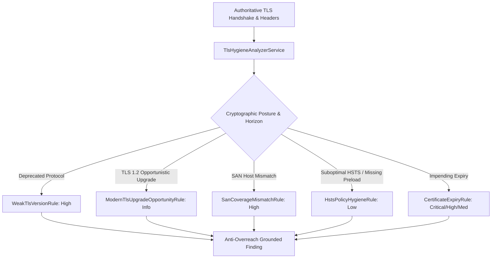

# S3 — Ingress Security Posture & TLS Hygiene Intelligence

## Status: CERTIFIED & FROZEN 🔒
**Phase:** Security Intelligence Hardening  
**Priority:** P0 — Transport Security & Operator Trust Critical  
**Depends on:** `S1` 🔒, `S2` 🔒, `H1`–`H8` 🔒  
**Unblocks:** `S4 — Content Security & Asset Integrity Intelligence`

---

## 1. Executive Summary

`S3 — Ingress Security Posture & TLS Hygiene` delivers deterministic, telemetry-backed cryptographic posture evaluation for modern edge ingress gateways. It analyzes negotiated TLS protocol versions, Subject Alternative Names (SAN), certificate validity horizons, and Strict-Transport-Security (HSTS) headers without indulging in speculative exploit claims.

---

## 2. Certified S3 Invariants

1. **`S3_TLS_VERSION_HYGIENE_INTEGRITY`**:
   Negotiated protocol versions are authoritatively classified into `DEPRECATED_UNSAFE` (TLS 1.0, 1.1), `STANDARD_SUPPORTED` (TLS 1.2), and `MODERN_OPTIMAL` (TLS 1.3).
2. **`S3_CERTIFICATE_HORIZON_INTEGRITY`**:
   Certificate validities are partitioned deterministically into `EXPIRED` ($\le 0$ days), `URGENT_EXPIRY` ($\le 7$ days), `UPCOMING_EXPIRY` ($\le 30$ days), and `HEALTHY` ($> 30$ days).
3. **`S3_SAN_COVERAGE_INTEGRITY`**:
   Evaluates Subject Alternative Names against target domains with full wildcard pattern matching support (`*.example.com` covers `api.example.com`).
4. **`S3_HSTS_POLICY_HYGIENE_INTEGRITY`**:
   Evaluates `Strict-Transport-Security` header quality (`max-age >= 15552000`, `includeSubDomains`, `preload` readiness) on HTTPS endpoints.
5. **`S3_ANTI_OVERREACH_ENFORCEMENT`**:
   All findings explicitly state what they do not prove:
   - Suboptimal HSTS does not prove active transport interception.
   - SAN mismatch confirms browser trust rejection, not backend compromise.
   - TLS 1.2 negotiation does not imply broken encryption.
6. **`S3_LIFECYCLE_ACTIVE_RESOLVED_CONVERGENCE`**:
   Findings transition seamlessly from `ACTIVE` in unhardened snapshot $N$ to `RESOLVED` in hardened snapshot $N+1$.

---

## 3. Rules & Architecture Summary

| Rule ID | Name | Severity | Risk Classification |
|---|---|---|---|
| `http.hsts-policy-hygiene` | Suboptimal HSTS Policy Duration or Scope | `LOW` | `SECURITY_HARDENING_GAP` |
| `ssl.san-coverage-mismatch` | Certificate SAN Domain Name Mismatch | `HIGH` | `CONFIRMED_SECURITY_CONDITION` |
| `ssl.modern-tls-upgrade-opportunity` | TLS 1.3 Upgrade Opportunity | `INFO` | `INFORMATIONAL_OBSERVATION` |
| `ssl.weak-tls-version` | Weak TLS Version Detected | `HIGH` | `CONFIRMED_SECURITY_CONDITION` |
| `ssl.certificate-expiry` | SSL Certificate Expiry Horizon | `CRITICAL`/`HIGH`/`MED` | `CONFIRMED_SECURITY_CONDITION` |

---

## 4. Master Verification & Quality Gate Audit

| Quality Gate | Status | Metric |
|---|---|---|
| **API Backend Unit & Integration Tests** | 🟢 **PASS** | 178 / 178 test suites, 1,216 / 1,216 tests passing (100%) |
| **Web Frontend Unit & Contract Tests** | 🟢 **PASS** | 837 / 837 test suites, 1,246 / 1,246 tests passing (100%) |
| **Master Smoke Test Matrix** | 🟢 **PASS** | 57 / 57 test cases passing (`S3-01`, `S3-02`, `S3-03` certified) |
| **Turborepo Build** | 🟢 **PASS** | `api` & `web` clean build in 8.8s |
