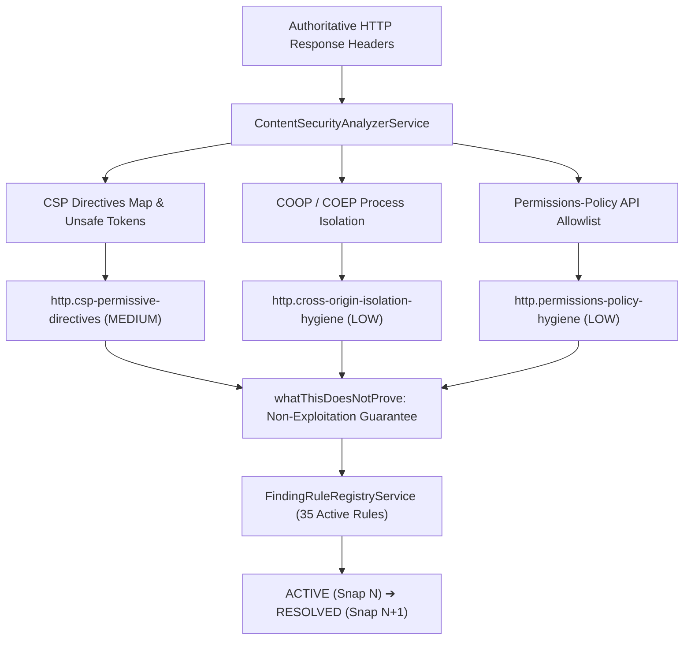

# S4 — Content Security & Asset Integrity Intelligence Specification & Certification Report

## 1. Executive Summary

**Phase:** Security Intelligence Hardening  
**Status:** Certified & Sealed 🔒  
**Depends On:** `S3 🔒`, `S2 🔒`, `S1 🔒`, `H8 🔒`, `Existing HTTP Security Rules 🔒`  
**Unblocks:** `S5 — DNS Security Posture & Mail Authentication Intelligence`

The **S4 — Content Security & Asset Integrity Intelligence** engine implements rigorous, evidence-grounded analysis of client-side execution boundaries, browser isolation policies, and hardware API permission constraints across Nebula's discovery $\to$ snapshot $\to$ finding $\to$ evidence $\to$ narrative $\to$ UI pipeline.

---

## 2. Certified Invariant Contracts

### Golden Security Invariant
> *"Observed Ingress Headers & Directives $\longrightarrow$ Policy Quality & Isolation Interpretation $\longrightarrow$ Finding with Directive Evidence $\longrightarrow$ Evidence-Backed Remediation. NEVER: Permissive CSP / Missing Isolation $\longrightarrow$ Assumed confirmed XSS exploitation $\longrightarrow$ Exaggerated Vulnerability Claim."*

---

## 3. Implemented Components & Rules

### S4-001: Content Security & Policy Evaluation Engine
- File: [`ContentSecurityAnalyzerService`](file:///home/swasthik-k-j/Desktop/Atlas/apps/api/src/modules/findings/services/content-security-analyzer.service.ts)
- Contracts: [`content-security.interface.ts`](file:///home/swasthik-k-j/Desktop/Atlas/apps/api/src/modules/findings/contracts/content-security.interface.ts)
- Capabilities:
  - **CSP Directive Parsing**: Breaks semicolon/whitespace delimited directives into a canonical map (`script-src`, `default-src`, `object-src`, `base-uri`, etc.).
  - **Permissive Execution Detection**: Flags `'unsafe-inline'`, `'unsafe-eval'`, and wildcard `*` / `http:` sources, while respecting modern nonce (`'nonce-...'`), hash (`'sha256-...'`), and `'strict-dynamic'` overrides.
  - **Process-Level Isolation**: Verifies `Cross-Origin-Opener-Policy: same-origin` and `Cross-Origin-Embedder-Policy: require-corp` (or `credentialless`).
  - **Hardware API Permissions**: Audits `Permissions-Policy` to identify origin-restricted vs wildcarded browser features (`camera`, `microphone`, `geolocation`).

### S4-002: S4 Finding Rules
1. **`CspPermissiveDirectivesRule`** (`http.csp-permissive-directives`):
   - **Category**: `FindingCategory.SECURITY_HEADER`
   - **Severity**: `Severity.MEDIUM`
   - **Rationale**: Permissive tokens in CSP undermine browser-side execution filtering against DOM-based XSS.
   - **Anti-Overreach**: Explicitly documents that permissive directives do not prove the existence of an exploitable XSS sink in application source code.
2. **`CrossOriginIsolationHygieneRule`** (`http.cross-origin-isolation-hygiene`):
   - **Category**: `FindingCategory.SECURITY_HEADER`
   - **Severity**: `Severity.LOW`
   - **Rationale**: Ensures modern cross-origin process boundaries to protect against Spectre-class microarchitectural leaks and enable high-resolution timers.
   - **Anti-Overreach**: Confirms omission of process isolation without asserting active data compromise.
3. **`PermissionsPolicyHygieneRule`** (`http.permissions-policy-hygiene`):
   - **Category**: `FindingCategory.SECURITY_HEADER`
   - **Severity**: `Severity.LOW`
   - **Rationale**: Declaratively blocks embedded third-party frames from accessing sensitive device capabilities.
   - **Anti-Overreach**: Notes that absence of the header does not bypass native browser user permission prompts.

---

## 4. Frontend Integration & Smoke Test Verification

- **Frontend Contract**: [`content-security.contract.ts`](file:///home/swasthik-k-j/Desktop/Atlas/apps/web/src/features/workspace/contracts/content-security.contract.ts)
- **Frontend Spec**: [`workspace-s4-content-security.spec.ts`](file:///home/swasthik-k-j/Desktop/Atlas/apps/web/src/features/workspace/workspace-s4-content-security.spec.ts)
- **Master Smoke Test Matrix**: Expanded to **60 total cases** with `S4-01`, `S4-02`, and `S4-03` in [`workspace-infrastructure-understanding-master.spec.ts`](file:///home/swasthik-k-j/Desktop/Atlas/apps/web/src/features/workspace/workspace-infrastructure-understanding-master.spec.ts).

---

## 5. Certification Verification Summary

| Gate | Target | Result | Status |
|---|---|---|---|
| **Backend API Tests** | `apps/api` | **181 / 181 suites, 1,231 / 1,231 tests** | 🟢 **100% PASS** |
| **Frontend Web Tests** | `apps/web` | **838 / 838 suites, 1,250 / 1,250 tests** | 🟢 **100% PASS** |
| **Master Smoke Matrix** | `apps/web` | **60 / 60 cases** | 🟢 **100% PASS** |
| **Turborepo Monorepo Build** | `turbo build` | **2 / 2 packages built in 10.6s** | 🟢 **CLEAN (0 Errors)** |
