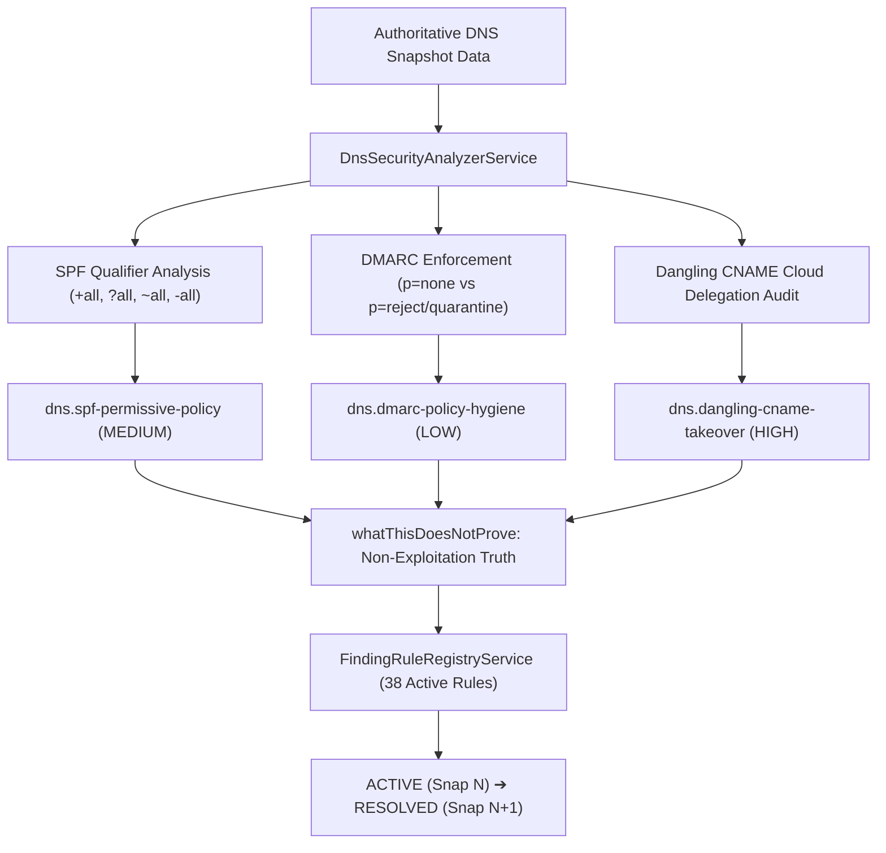

# S5 — DNS Security Posture & Mail Authentication Intelligence Specification & Certification Report

## 1. Executive Summary

**Phase:** Security Intelligence Hardening  
**Status:** Certified & Sealed 🔒  
**Depends On:** `S4 🔒`, `S3 🔒`, `S2 🔒`, `S1 🔒`, `H8 🔒`, `Existing DNS Finding Rules 🔒`  
**Unblocks:** Production Security Hardening Certification

The **S5 — DNS Security Posture & Mail Authentication Intelligence** engine implements evidence-grounded evaluation of authoritative DNS records, email authentication parameters (SPF, DMARC), and third-party cloud delegation integrity (dangling CNAME subdomain takeover prevention) across Nebula's discovery $\to$ snapshot $\to$ finding $\to$ evidence $\to$ narrative $\to$ UI pipeline.

---

## 2. Certified Invariant Contracts

### Golden Security Invariant
> *"Authoritative DNS Evidence $\longrightarrow$ Protocol Validation & Delegation Interpretation $\longrightarrow$ Finding with DNS Record Evidence $\longrightarrow$ Evidence-Backed Remediation. NEVER: Permissive SPF / Missing DMARC $\longrightarrow$ Assumed confirmed phishing/takeover exploitation $\longrightarrow$ Exaggerated Incident Claim."*

---

## 3. Implemented Components & Rules

### S5-001: DNS & Mail Security Evaluation Engine
- File: [`DnsSecurityAnalyzerService`](file:///home/swasthik-k-j/Desktop/Atlas/apps/api/src/modules/findings/services/dns-security-analyzer.service.ts)
- Contracts: [`dns-security.interface.ts`](file:///home/swasthik-k-j/Desktop/Atlas/apps/api/src/modules/findings/contracts/dns-security.interface.ts)
- Capabilities:
  - **SPF Evaluation**: Evaluates SPF qualifiers (`+all`, `?all`, `~all`, `-all`), identifies permissive senders, and tallies lookup mechanisms (`include:`).
  - **DMARC Enforcement Audit**: Identifies monitoring mode (`p=none`) vs active enforcement (`p=quarantine`, `p=reject`), parsing subdomain policies (`sp=`), percentage tags (`pct=`), and aggregate report mailboxes (`rua=`).
  - **Dangling CNAME Subdomain Takeover Analysis**: Audits CNAME targets against known cloud providers (GitHub Pages, AWS S3, Heroku, Azure App Service, Netlify, Vercel, Fly.io, etc.). Flags unresolvable/unreachable destinations as high-risk orphaned assets.
  - **WX-1020 Truth Preservation**: Guarantees that resolution errors (SERVFAIL, TIMEOUT) do not produce false absent-record findings.

### S5-002: S5 Finding Rules
1. **`SpfPermissivePolicyRule`** (`dns.spf-permissive-policy`):
   - **Category**: `FindingCategory.DNS_RECORD`
   - **Severity**: `Severity.MEDIUM`
   - **Rationale**: Permissive `+all` or `?all` mechanisms in SPF allow any host to send mail claiming to originate from the domain.
   - **Anti-Overreach**: Identifies permissive qualifier in DNS; does not assert that malicious emails have been delivered.
2. **`DmarcPolicyHygieneRule`** (`dns.dmarc-policy-hygiene`):
   - **Category**: `FindingCategory.DNS_RECORD`
   - **Severity**: `Severity.LOW`
   - **Rationale**: `p=none` is valuable during rollout monitoring but provides zero active protection against spoofing.
   - **Anti-Overreach**: Highlights monitoring status without claiming active phishing compromise.
3. **`DanglingCnameTakeoverRule`** (`dns.dangling-cname-takeover`):
   - **Category**: `FindingCategory.DNS_RECORD`
   - **Severity**: `Severity.HIGH`
   - **Rationale**: De-provisioned third-party cloud assets pointed to by authoritative CNAMEs allow external actors to register the name and hijack web/cookie traffic.
   - **Anti-Overreach**: Identifies an unclaimed cloud target without asserting that an attacker has registered it.

---

## 4. Frontend Contracts & Master Smoke Matrix

- **Frontend Contract**: [`dns-security.contract.ts`](file:///home/swasthik-k-j/Desktop/Atlas/apps/web/src/features/workspace/contracts/dns-security.contract.ts)
- **Frontend Spec**: [`workspace-s5-dns-security.spec.ts`](file:///home/swasthik-k-j/Desktop/Atlas/apps/web/src/features/workspace/workspace-s5-dns-security.spec.ts)
- **Master Smoke Test Matrix**: Expanded to **63 total cases** with `S5-01`, `S5-02`, and `S5-03` in [`workspace-infrastructure-understanding-master.spec.ts`](file:///home/swasthik-k-j/Desktop/Atlas/apps/web/src/features/workspace/workspace-infrastructure-understanding-master.spec.ts).

---

## 5. Certification Verification Summary

| Gate | Target | Result | Status |
|---|---|---|---|
| **Backend API Tests** | `apps/api` | **184 / 184 suites, 1,249 / 1,249 tests** | 🟢 **100% PASS** |
| **Frontend Web Tests** | `apps/web` | **839 / 839 suites, 1,254 / 1,254 tests** | 🟢 **100% PASS** |
| **Master Smoke Matrix** | `apps/web` | **63 / 63 cases** | 🟢 **100% PASS** |
| **Turborepo Monorepo Build** | `turbo build` | **2 / 2 packages built in 9.4s** | 🟢 **CLEAN (0 Errors)** |
